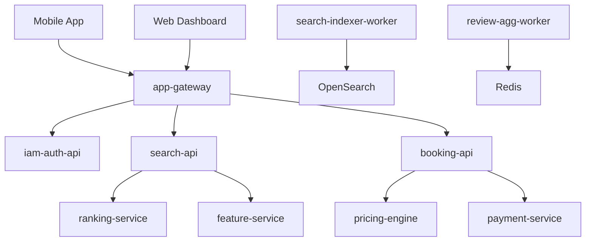

# Chessmate Engineering Guide

This document serves as the definitive guide for building and maintaining the Monocto travel platform. It establishes architectural principles, development workflows, and quality standards for our polyglot monorepo.

> **📚 Documentation Note**: Before creating any documentation, review the [Documentation Standards](#documentation-standards) section and use the 4-level hierarchy decision tree. All documentation must follow the structured placement rules. See [`docs/README.md`](docs/README.md) for comprehensive guidelines.

## Table of Contents

1. [Architecture Philosophy](#architecture-philosophy)
2. [Development Principles](#development-principles)
3. [Service Ecosystem](#service-ecosystem)
4. [Development Workflow](#development-workflow)
5. [Programming Language Guides](#programming-language-guides)
6. [Quality Standards](#quality-standards)
7. [Documentation Standards](#documentation-standards) ⭐ **READ THIS BEFORE DOCUMENTING**

---

## Architecture Philosophy

### Core Principles

**Domain-Driven Design (DDD)**
- Code organized by business capabilities, not technical layers
- Clear bounded contexts with explicit interfaces
- Rich domain models containing business logic
- Event-driven integration between contexts

**Contract-First Development**
- OpenAPI specifications define all HTTP APIs
- Generated SDKs ensure type safety across services
- Schema evolution managed through versioning
- Consumer-driven contract testing

**Polyglot Monorepo**
- Right tool for the right job
- Shared infrastructure and tooling
- Unified build and deployment pipeline
- Cross-language type safety through contracts

**Developer Experience (DX)**
- Five core commands: `init`, `up`, `dev`, `test`, `build`
- Fast feedback loops with affected builds
- Comprehensive local development environment
- Clear documentation and examples

### Quality Attributes

- **Maintainability**: Clear boundaries, separation of concerns, comprehensive tests
- **Scalability**: Stateless services, proper caching, efficient data access
- **Reliability**: Circuit breakers, retries, graceful degradation
- **Observability**: Structured logging, distributed tracing, metrics
- **Security**: Authentication, authorization, encryption, audit trails

---

## Development Principles

### Do's ✅

**Architecture & Design**
- Organize code by business domains, not technical layers
- Use interfaces for cross-service communication
- Implement proper aggregate boundaries in domain models
- Design for eventual consistency between bounded contexts
- Apply the principle of least privilege for security

**Code Quality**
- Write self-documenting code with clear naming (no inline comments)
- Apply SOLID principles rigorously - never compromise for "quick solutions"
- Keep functions and classes focused on single responsibilities
- Abstract complex logic into well-named methods and classes
- Use type-safe contracts between services
- Implement comprehensive error handling
- Write tests that document behavior
- Prefer scalable solutions over "works for now" approaches

**Development Workflow**
- Start with contracts (OpenAPI/GraphQL schemas)
- Generate SDKs before implementing services
- Use affected builds for efficient CI/CD
- Document architectural decisions (ADRs)
- Update service glossary when adding/modifying services

**Documentation**
- Follow the 4-level documentation hierarchy (see [Documentation Standards](#documentation-standards))
- Use the documentation decision tree to determine correct location
- Platform-wide docs go in `/docs/`, service-specific in `/{service}/docs/`
- Cross-domain integrations use versioned snapshots in `/docs/integrations/versions/`
- Always update relevant README files when adding features

### Don'ts ❌

**Architecture Anti-Patterns**
- No direct service-to-service dependencies
- No shared databases between services
- No business logic in controllers or repositories
- No circular dependencies between bounded contexts
- No hardcoded configuration or secrets

**Code Anti-Patterns**
- No multiple classes per file (strict one-class-per-file rule)
- No inline comments (code must be self-explanatory)
- No god objects or services (apply Single Responsibility Principle)
- No primitive obsession (use value objects)
- No anemic domain models
- No "quick fix" solutions that compromise scalability
- No violation of SOLID principles for convenience
- No untested code paths

**Development Anti-Patterns**
- No breaking changes without versioning
- No manual deployment processes
- No undocumented APIs or services
- No skipping code reviews
- No ignoring failing tests

**Documentation Anti-Patterns**
- No documentation in wrong hierarchy level (use decision tree)
- No loose integration docs at repository root
- No service docs outside `/{service}/docs/` structure
- No unversioned cross-domain integration documentation
- No duplicate documentation in multiple locations
- No documentation without clear ownership (platform vs service)

---

## Service Ecosystem

### Service Types

| Type | Purpose | Examples | Naming Pattern |
|------|---------|----------|----------------|
| **`*-api`** | External HTTP interfaces (BFFs, partner APIs) | `search-api`, `booking-api`, `iam-auth-api` | Externally consumed |
| **`*-service`** | Internal synchronous services | `ranking-service`, `feature-service` | Backend-to-backend |
| **`*-worker`** | Asynchronous/background processing | `search-indexer-worker`, `review-agg-worker` | Event processing |
| **`*-engine`** | Specialized compute layers | `pricing-engine`, `recommendation-engine` | Complex algorithms |

### Technology Stack by Domain

| Domain | Primary Language | Framework | Database | Key Patterns |
|--------|------------------|-----------|----------|--------------|
| **Identity & Auth** | Kotlin | Spring Boot | PostgreSQL | RBAC, OAuth2, SAML |
| **Search & Discovery** | Go | Chi/Fiber | OpenSearch | Full-text search, faceting |
| **Booking & Payments** | Kotlin | Spring Boot | PostgreSQL | Saga pattern, event sourcing |
| **Content & Reviews** | Python | FastAPI | PostgreSQL | NLP, content moderation |
| **Real-time Features** | Rust | Actix Web | Redis | WebSocket, caching |
| **Client Applications** | TypeScript | React/React Native | - | BFF pattern, offline-first |

### Service Dependencies



---

## Development Workflow

### Initial Setup

```bash
# Clone and initialize the monorepo
git clone <repository-url>
cd chessmate
make init                    # Install dependencies and generate SDKs
```

### Daily Development

```bash
# Start backing services (databases, caches, etc.)
make dev-up

# Start all application services
make dev

# Run affected tests
pnpm nx affected -t test

# Build affected projects
pnpm nx affected -t build

# Clean up
make dev-down
```

### Service Development Lifecycle

1. **Design Phase**
   - Define OpenAPI contract in `/contracts/openapi/`
   - Update service glossary in `docs/service-spec.md`
   - Create ADR if architectural decision required

2. **Implementation Phase**
   - Generate SDKs: `pnpm gen`
   - Implement service following language-specific architecture guide
   - Write comprehensive tests (unit, integration, contract)

3. **Integration Phase**
   - Update affected services to use new contracts
   - Run full test suite: `make test`
   - Verify local deployment: `make dev`

4. **Documentation Phase**
   - Update service README with build/run/test instructions
   - Document domain concepts and ubiquitous language
   - Add operational runbook if needed

### Git Workflow

```bash
# Feature development
git checkout -b feature/service-name-capability
# ... make changes ...
git commit -m "feat(service-name): add capability description"

# Update service glossary if new service
# Update contracts if API changes
# Ensure all tests pass

git push origin feature/service-name-capability
# Create pull request
```

---

## Programming Language Guides

### Kotlin Services
**Architecture**: Domain-Driven Design with Spring Boot
**Guide**: [`docs/architecture-kotlin.md`](docs/architecture-kotlin.md)
**Key Patterns**: Aggregate roots, domain events, repository pattern
**Testing**: JUnit 5, Testcontainers, architecture tests

### Go Services  
**Architecture**: Clean architecture with Chi/Fiber
**Guide**: [`docs/architecture-go.md`](docs/architecture-go.md)
**Key Patterns**: Dependency injection, middleware, structured logging
**Testing**: Table-driven tests, Testcontainers integration

### Python Services
**Architecture**: FastAPI with Pydantic models
**Guide**: [`docs/architecture-python.md`](docs/architecture-python.md)
**Key Patterns**: Async/await, dependency injection, type hints
**Testing**: pytest, async test patterns, ML model testing

### Rust Services
**Architecture**: Actix Web with strong typing
**Guide**: [`docs/architecture-rust.md`](docs/architecture-rust.md)
**Key Patterns**: Error handling, async streams, zero-copy serialization
**Testing**: Unit tests, integration tests, benchmarks

### TypeScript Services
**Architecture**: Node.js with GraphQL/REST
**Guide**: [`docs/architecture-typescript.md`](docs/architecture-typescript.md)
**Key Patterns**: BFF pattern, schema-first GraphQL, middleware
**Testing**: Vitest, supertest, contract testing

---

## Quality Standards

### Code Quality

**Test Coverage**
- Minimum 80% line coverage for business logic
- 100% coverage for critical paths (auth, payments)
- Integration tests for all external interfaces
- Contract tests between services

**Code Review**
- All changes require peer review
- Architecture changes require senior review
- Security-sensitive changes require security review
- Performance-critical changes require performance review

**Static Analysis**
- Language-specific linters (ESLint, ktlint, golangci-lint)
- Security scanning (Trivy, CodeQL)
- Dependency vulnerability scanning
- License compliance checking

### Performance Standards

**Response Times**
- API endpoints: p95 < 200ms
- Search queries: p95 < 500ms
- Background jobs: process within SLA
- Database queries: < 100ms for simple operations

**Scalability**
- Services must be stateless
- Horizontal scaling capability
- Proper connection pooling
- Efficient caching strategies

### Security Standards

**Authentication & Authorization**
- JWT-based authentication via `iam-auth-api`
- Role-based access control (RBAC)
- Principle of least privilege
- Regular token rotation

**Data Protection**
- Encryption at rest and in transit
- PII data minimization
- Audit logging for sensitive operations
- GDPR compliance for user data

---

## Documentation Standards

### Documentation Structure and Placement

**CRITICAL**: Before creating or modifying documentation, follow the 4-level hierarchy and decision tree below. Documentation in the wrong location creates confusion and maintenance burden.

See [`docs/README.md`](docs/README.md) for comprehensive documentation guidelines and examples.

### Documentation Hierarchy

```
/
├── AGENTS.md                           # This file - root engineering guide
├── README.md                           # Repository overview
│
├── docs/                               # Level 1: Platform-wide documentation
│   ├── README.md                       # Documentation structure guide (read this first!)
│   │
│   ├── architecture-{lang}.md          # Language-specific architecture guides
│   ├── service-spec.md                 # Service catalog and conventions
│   ├── pcm-contracts.md                # API contracts
│   ├── certificate-management.md       # Platform standards
│   │
│   ├── {domain}/                       # Level 2: Domain/cross-service docs
│   │   ├── README.md                   # Domain overview
│   │   ├── architecture.md             # Domain architecture
│   │   ├── developer-guide.md          # Development guide
│   │   └── integration-guide.md        # Integration patterns
│   │
│   └── integrations/                   # Level 3: Platform-wide integrations
│       ├── README.md                   # Integration guidelines
│       └── versions/                   # Versioned integration snapshots
│           └── {integration}-{type}-v{ver}-{date}.md
│
├── {service-name}/                     # Level 4: Service-specific (REQUIRED STRUCTURE)
│   ├── README.md                       # Build, run, test instructions (required)
│   └── docs/                           # Service documentation (required)
│       ├── README.md                   # Service overview (required)
│       ├── GETTING_STARTED.md          # Dev setup guide (required)
│       ├── overview.md                 # API/feature specification
│       ├── ARCHITECTURE.md             # Technical design
│       ├── RUNBOOK.md                  # Operational procedures
│       ├── integrations/               # Service-specific integrations
│       │   └── {integration}.md        # Implementation details
│       └── migrations/                 # Iterative development phases
│           ├── README.md               # Phase versioning guide
│           ├── phase-1.md              # MVP/Phase 1 decisions
│           ├── phase-2.md              # Phase 2 enhancements
│           └── phase-{N}.md            # Future phases
│
└── contracts/                          # API contracts
    └── openapi/                        # OpenAPI specifications
```

### Documentation Decision Tree

**Use this before creating any documentation:**

```
What type of documentation are you creating?

├─ Platform-wide standard or architectural guideline?
│  └─ → /docs/{topic}.md
│      Examples: architecture-kotlin.md, service-spec.md, certificate-management.md
│
├─ Specific to a language/technology stack?
│  └─ → /docs/architecture-{language}.md
│      Examples: architecture-kotlin.md, architecture-python.md, architecture-rust.md
│
├─ Spanning multiple services within a domain/bounded context?
│  └─ → /docs/{domain}/{topic}.md
│      Examples: docs/pricing-engine/architecture.md, docs/pricing-engine/developer-guide.md
│
├─ Cross-domain integration affecting multiple services?
│  ├─ High-level overview or versioned snapshot?
│  │  └─ → /docs/integrations/versions/{integration}-{type}-v{version}-{date}.md
│  │      Examples: iam-auth-integration-v1-2025-11-05.md
│  │                experimentation-integration-v1-2025-11-05.md
│  │
│  └─ Service-specific implementation?
│     └─ → /{service-name}/docs/integrations/{integration}.md
│         Examples: pricing-gateway/docs/integrations/iam-authentication.md
│                   pricing-silo/docs/integrations/experimentation.md
│
└─ Service-specific operational or implementation detail?
   └─ → /{service-name}/docs/{topic}.md
       Examples: booking-api/docs/RUNBOOK.md, iam-auth-api/docs/RATE_LIMITING.md
```

### Documentation Placement Rules

**Level 1: Platform-Wide (`/docs/`)**

Use when:
- Applies to all services or multiple domains
- Architectural standards or patterns
- Technology stack guidelines
- Platform-wide tooling or infrastructure

Examples:
- Language architecture guides (how to structure services)
- Service naming and categorization conventions
- Platform-wide security standards

**Level 2: Domain-Specific (`/docs/{domain}/`)**

Use when:
- Applies to multiple services within a bounded context
- Domain architecture and concepts
- Cross-service workflows within the domain
- Shared domain models and ubiquitous language

Examples:
- `/docs/pricing-engine/architecture.md` - Pricing domain architecture
- `/docs/pricing-engine/domain-model.md` - Pricing domain concepts
- `/docs/pricing-engine/experimentation-integration.md` - How experimentation works across pricing

**Level 3: Platform Integrations (`/docs/integrations/`)**

Use when:
- Cross-domain integration affecting multiple services
- Platform-wide infrastructure integration
- Multiple teams/services affected
- Requires versioned historical record

Naming convention: `{integration-name}-{type}-v{version}-{date}.md`
- Types: `integration`, `tests-status`, `test-findings`, `final-summary`
- Example: `experimentation-integration-v1-2025-11-05.md`

Examples:
- IAM authentication rollout across services
- Experimentation framework integration
- Service mesh adoption

**Level 4: Service-Specific (`/{service-name}/docs/`)**

Use when:
- Specific to a single service
- Implementation details
- Service-specific configuration
- Operational procedures

Examples:
- Service overview and capabilities
- How to configure and run the service
- Service-specific integration implementations
- Troubleshooting and runbooks

### Service Documentation Requirements

Every service MUST follow this documentation structure under `/{service-name}/docs/`:

```
{service-name}/
├── README.md                    # Root service README (required)
└── docs/
    ├── README.md               # Service overview (required)
    ├── GETTING_STARTED.md      # Development setup (required)
    ├── overview.md             # API/feature specification
    ├── ARCHITECTURE.md         # Technical design
    ├── RUNBOOK.md              # Operational procedures
    ├── integrations/           # Service-specific integrations
    │   └── {integration}.md    # Implementation details
    └── migrations/             # Iterative development phases
        ├── phase-1.md          # Phase 1 plan and decisions
        ├── phase-2.md          # Phase 2 plan and decisions
        └── README.md           # Versioning guide
```

**Service README.md** (in service root - `/{service-name}/README.md`)
- Quick start: build, run, test commands
- Dependencies and prerequisites
- Environment configuration
- Common troubleshooting
- Links to documentation in `docs/` folder

**Service docs/README.md** (service context - `/{service-name}/docs/README.md`)
- Business domain and capabilities
- Ubiquitous language glossary
- API overview and key endpoints
- Integration patterns
- Service dependencies

**Service docs/GETTING_STARTED.md** (development guide - `/{service-name}/docs/GETTING_STARTED.md`)
- Step-by-step development environment setup
- Database initialization
- Running tests
- Common development tasks
- Troubleshooting development issues

**Service docs/overview.md** (specification - `/{service-name}/docs/overview.md`)
- API endpoints with examples
- Data models and schemas
- Feature specification
- Scope and limitations
- Future enhancements

**Service docs/ARCHITECTURE.md** (technical design - `/{service-name}/docs/ARCHITECTURE.md`)
- System architecture diagram
- Component relationships
- Data flow
- Design patterns used
- Technical decisions and trade-offs

**Service docs/RUNBOOK.md** (operations - `/{service-name}/docs/RUNBOOK.md`)
- Deployment procedures
- Monitoring and alerting setup
- Incident response procedures
- Performance tuning
- Log analysis and debugging

**Service docs/integrations/{integration}.md** (cross-service integration)
- How this service integrates with other services
- APIs consumed and provided
- Event contracts
- Error handling
- Testing integration

**Service docs/migrations/README.md** (phase versioning guide)
- Overview of service development phases
- How to document new phases
- Naming convention: `phase-{number}.md`
- Version history and decisions

**Service docs/migrations/phase-{N}.md** (iterative development)
- Phase objectives and goals
- Scope: what's included/excluded
- Architecture decisions made
- Database schema changes
- API endpoints added/modified
- Breaking changes
- Testing strategy
- Deployment considerations
- Dependencies on other services
- Blockers or risks

### Service Documentation Template Checklist

When creating a new service, ensure:
- [ ] `/{service-name}/README.md` exists with quickstart
- [ ] `/{service-name}/docs/README.md` exists with overview
- [ ] `/{service-name}/docs/GETTING_STARTED.md` exists with setup steps
- [ ] `/{service-name}/docs/overview.md` exists with API spec
- [ ] `/{service-name}/docs/ARCHITECTURE.md` exists with design
- [ ] `/{service-name}/docs/RUNBOOK.md` exists with operations
- [ ] `/{service-name}/docs/migrations/README.md` exists
- [ ] `/{service-name}/docs/migrations/phase-1.md` documents MVP

### Documentation Principles

**Clarity**
- Write for your future self and new team members
- Use clear, concise language
- Provide concrete examples
- Keep documentation close to code

**Completeness**
- Document the "why" not just the "what"
- Include error scenarios and edge cases
- Provide troubleshooting guides
- Maintain up-to-date examples

**Consistency**
- Follow established templates
- Use consistent terminology
- Maintain cross-references
- Regular documentation reviews

**Versioning Documentation**
- Use `docs/migrations/` like git commits for services
- Track decisions and rationale for each phase
- Link phases to git tags/releases
- Never delete old phase documentation
- Use semantic versioning: v{major}.{minor}.{patch}

---

## Getting Help

### Resources

- **Architecture Questions**: Review language-specific guides in `/docs/`
- **Service Information**: Check service glossary in `docs/service-spec.md`
- **API Contracts**: Browse OpenAPI specs in `/contracts/openapi/`
- **Operational Issues**: Consult service runbooks in `{service}/docs/RUNBOOK.md`

### Escalation Path

1. **Self-Service**: Documentation, code examples, existing patterns
2. **Team Discussion**: Architecture decisions, design patterns
3. **Technical Review**: Complex changes, performance concerns
4. **Architecture Review**: Cross-service changes, new patterns

---

*This guide is a living document. Update it as the platform evolves and new patterns emerge.*