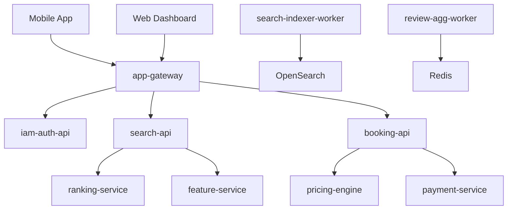

# AGENTS GUIDE

A unified operating contract for all AI agents and automated assistants working inside this monorepo.

Agents **MUST** obey this file before writing code, generating docs, or modifying any folder in this repository.

---

## 0. Agent Core Principles

### Mindset: Think → Verify → Act

**Agents are proactive architecture-aware assistants, not reactive code generators.**

Before writing ANY code or documentation, agents **MUST** complete the Pre-Flight Checklist below.

---

## 0.0. Pre-Flight Checklist (MANDATORY)

Run this sequence before writing code, generating diffs, or touching any file.

### Step 0: Clarify Intent
- Do I understand what the user wants as the final output?
- Is the scope clear enough to produce code or changes?
- Is the affected component/service obvious?
  - If yes → proceed.
  - If a crucial detail is missing → ask exactly ONE targeted question.
  - No philosophical questions. No “why” loops.

### Step 1: Understand the Request
- What feature, fix, or change is being asked for?
- Is this UI, API, business logic, infra, data, or documentation?
- Which folders/services/domains in the monorepo are affected?
- What is explicitly in scope, and what is out?

### Step 2: Check Alignment & Alternatives (Internal)
- Is coding the necessary solution? (vs config, existing flags, documentation, or simple refactor)
- Is there a smaller or safer vertical slice?
- Can this be behind a feature flag?
- This step never triggers questions to the user unless blocking.

### Step 3: Map System Impact
- Which bounded contexts are touched?
- What upstream/downstream flows are affected?
- Does this change cross service boundaries?
- Does this introduce new failure modes, latencies, or data shapes?
- Mentally sketch: Request → Layers → Side Effects → Outputs

### Step 4: Search for Existing Patterns (Prefer Reuse)
- Does similar functionality already exist in the monorepo?
- Are there reusable components, clients, utilities, or DLS patterns?
- Does the *-client, *-engine, or UI DLS already support this?
- If creating a new pattern, should this become the golden path?
- Agents must avoid duplicating patterns unless explicitly instructed.

### Step 5: Identify Relevant Documentation
- Which architecture guidelines apply?
- For UI: docs/design-language-system.md
- For services: {service}/docs/overview.md + architecture-*.md
- For agents: AGENTS.md
- For API: Bruno collections
- Update existing docs, do not scatter new files unless necessary.

### Step 6: Architecture & NFR Check
- Evaluate the change against:
  - DDD boundaries
  - Clean Architecture/domain purity
  - Latency budgets / hot paths
  - Idempotency, retries, caching
  - Tenancy boundaries & access control
  - Data consistency & migrations
  - Infra & cost impact
- If NFR shifts significantly → generate design note or ADR.

### Step 7: Plan the Implementation
- Define:
  - Files to create/update
  - Functions/modules/classes to modify
  - Tests: unit, integration, contract, e2e
  - API updates (Bruno collections)
  - Migrations, flags, configs
  - Directory alignment with dx-cli conventions
- The agent should output a short structured plan before diffing.

### Step 8: Rollout, Migration, and Rollback Strategy
- Will this ship behind a feature flag?
- Does it support backward compatibility?
- Any dual-writes or data migrations?
- How do we rollback instantly if something breaks?
- What metrics/logs will signal success or regression?
- Every change must have a safe unwind path.

### Step 9: Stakeholder Awareness
- (Internal unless the user asks to notify)
- Who else might be affected? (other service owners, SRE, analytics, data consumers)
- Should this be structured as a design review?
- Will this change surprise anyone in the runtime graph?
- Agents usually skip notifications unless explicitly instructed.

### Step 10: Verify Compliance
- Am I following the monorepo’s golden paths?
- Am I reusing components instead of duplicating them?
- Are file locations consistent with dx-cli conventions?
- Are docs updated in the correct place?
- Does the final output match intent and avoid speculative work?

---

## 0.1. Trigger Phrase – Mandatory Rule

If any user message contains the exact phrase:

**"please read AGENTS.md"**

Then the agent **MUST**:

1. Open this file and re-read it entirely.
2. Complete the Pre-Flight Checklist (Section 0.0) for the request.
3. Identify which rules apply to the user's request.
4. State (briefly) which rules will govern the action.
5. Apply those rules strictly.

If the request violates these rules, the agent **MUST**:

- Explain the conflict
- Propose the correct, compliant alternative
- Never proceed with the invalid approach

This phrase **overrides all previous instructions** and enforces strict compliance.

---

## 0.2. Context-Aware Guidelines: Think Before You Code

**Before modifying ANY code, activate the appropriate mental model:**

---

### 🎨 UI Development: Design Language System (DLS) First

**When working on `app/ui/` or `app/features/` components:**

#### Required Reading:
1. [`app/docs/design-language-system.md`](app/docs/design-language-system.md) — Complete DLS specification
2. [`app/docs/ai-agent-quick-reference.md`](app/docs/ai-agent-quick-reference.md) — File placement & patterns
3. [`app/docs/folder-structure-convention.md`](app/docs/folder-structure-convention.md) — Structure rules

#### Think This Way (Positive Patterns):

**1. "Does our DLS already provide this?"**
   - ✅ Check [`app/ui/primitives/`](app/ui/primitives/) for existing components
   - ✅ Check [`app/ui/tokens/`](app/ui/tokens/) for design tokens
   - ✅ Search DLS docs for similar patterns
   - ✅ Example: "Need a button → Let me check if Button primitive supports this style"

**2. "Can I compose this from existing primitives?"**
   - ✅ Use `Button`, `Text`, `Box`, `Card` from primitives
   - ✅ Combine primitives instead of creating from scratch
   - ✅ Follow composition patterns from DLS
   - ✅ Example: "Need a card with button → Let me compose Card + Button primitives"

**3. "What design tokens should I use?"**
   - ✅ Colors from `colorTokens` or `useColors()` hook
   - ✅ Spacing from `spacingTokens` (e.g., `spacingTokens.md`)
   - ✅ Typography from `textVariants`
   - ✅ Shadows from `shadowTokens`
   - ✅ Example: "Need spacing → Let me use spacingTokens.md"

**4. "Is this theme-aware?"**
   - ✅ Will it work in both light and dark mode?
   - ✅ Am I using `useColors()` or `useIsDark()`?
   - ✅ Are color values dynamic based on theme?
   - ✅ Example: "Need colors → Let me use useColors() for theme support"

**5. "Should I update DLS documentation?"**
   - ✅ Adding new pattern → Update `design-language-system.md`
   - ✅ Creating new primitive → Document in DLS + add JSDoc
   - ✅ Modifying existing component → Update DLS section
   - ✅ Example: "Created new variant → Let me add it to DLS docs"

#### Architectural Principles:
- **Vertical slicing**: Features are self-contained in `/features/{feature}/`
- **Horizontal layering**: UI primitives in `/ui/`, services in `/services/`, core in `/core/`
- **Design tokens**: All visual properties come from `/ui/tokens/`
- **Composition over creation**: Extend existing components before creating new ones
- **Theme-aware**: All components must support light/dark mode
- **Type safety**: Proper TypeScript types for all props
- **Public APIs**: Export through `index.ts` with JSDoc

#### Critical Rules:
- ✅ Features go in `/features/{feature}/`
- ✅ UI components go in `/ui/primitives/` or `/ui/components/`
- ✅ API clients go in `/services/api/`
- ✅ Use design tokens from `/ui/tokens/`
- ✅ Update `design-language-system.md` when adding patterns
- ❌ No circular dependencies between features
- ❌ No business logic in route files (`/app`)
- ❌ No hard-coded colors (e.g., `#FFFFFF`, `rgba(255,255,255,0.5)`)
- ❌ No hard-coded spacing (e.g., `padding: 16`)
- ❌ No hard-coded typography (e.g., `fontSize: 14`)

---

### 🏗️ Backend Development: Architecture Patterns First

**When working on services (APIs, workers, engines):**

#### Required Reading:
1. `{service}/docs/overview.md` — Service capabilities and scope
2. `docs/architecture-{language}.md` — Language-specific patterns
   - [`docs/architecture-kotlin.md`](docs/architecture-kotlin.md) — DDD patterns
   - [`docs/architecture-go.md`](docs/architecture-go.md) — Clean architecture
   - [`docs/architecture-python.md`](docs/architecture-python.md) — FastAPI patterns
   - [`docs/architecture-rust.md`](docs/architecture-rust.md) — Actix Web patterns
   - [`docs/architecture-typescript.md`](docs/architecture-typescript.md) — BFF patterns

#### Think This Way (Positive Patterns):

**1. "What architectural pattern applies?"**
   - ✅ Kotlin services → Domain-Driven Design (DDD)
   - ✅ Go services → Clean Architecture
   - ✅ Python services → FastAPI with Pydantic
   - ✅ Rust services → Actix Web with strong typing
   - ✅ TypeScript services → BFF pattern with GraphQL/REST

**2. "Where does this logic belong?"**
   - ✅ Business rules → Domain layer
   - ✅ API routes → Application layer (use cases)
   - ✅ Database access → Infrastructure layer
   - ✅ External APIs → Infrastructure layer

**3. "Are there existing patterns I should follow?"**
   - ✅ Check similar endpoints in the same service
   - ✅ Review language-specific architecture guide
   - ✅ Look for reusable domain models or utilities

**4. "What documentation needs updating?"**
   - ✅ New endpoint → Update `docs/api.md` + create Bruno collection
   - ✅ Domain changes → Update `docs/domain.md`
   - ✅ Architecture changes → Update `docs/ARCHITECTURE.md`
   - ✅ Operational changes → Update `docs/RUNBOOK.md`

#### Bruno API Collections (Mandatory for HTTP APIs):
- ✅ Every endpoint → One `.bru` file in `bruno/collections/`
- ✅ Multi-step flows → Test files in `bruno/tests/`
- ✅ All requests → Include assertions
- ✅ See [Bruno API Collections Standard](#bruno-api-collections-standard) below

---

### 📚 Documentation: Update Shared Context, Create for New Context

**When creating or modifying documentation:**

#### Required Reading:
1. This file (AGENTS.md) — Documentation hierarchy and decision tree
2. [`docs/README.md`](docs/README.md) — Documentation structure guide

#### Think This Way (Positive Patterns):

**1. "Is this shared context or new context?"**
   - ✅ **Shared context** (DLS, architecture, overview) → Update existing docs
   - ✅ **New context** (new feature, new integration, new phase) → Create new docs
   - ✅ Example: "Adding button variant → Update DLS (shared context)"
   - ✅ Example: "New payment integration → Create new doc (new context)"

**2. "Does documentation for this shared context already exist?"**
   - ✅ Search for related `.md` files first
   - ✅ Check service `docs/` folder
   - ✅ Check platform-wide `/docs/` folder
   - ✅ Use documentation decision tree (Section "Documentation Decision Tree" below)

**3. "Where does this belong in the hierarchy?"**
   - ✅ Platform-wide → `/docs/`
   - ✅ Domain-specific → `/docs/{domain}/`
   - ✅ Service-specific → `/{service}/docs/`
   - ✅ Integration → `/docs/integrations/` or `/{service}/docs/integrations/`

**4. "Should I update existing docs or create new ones?"**
   - ✅ **Update existing** if it's shared context (DLS, architecture, API patterns)
   - ✅ **Create new** if it's new context (new feature, new integration, new workflow)
   - ✅ **Never scatter** shared context across multiple files
   - ✅ Example: "Button variant → Update design-language-system.md (shared DLS context)"
   - ✅ Example: "New OAuth flow → Create oauth-integration.md (new integration context)"

**5. "What related docs need updating?"**
   - ✅ DLS changes → Update `app/docs/design-language-system.md`
   - ✅ New feature → Create feature README + update `app/docs/overview.md` feature list
   - ✅ API changes → Update `docs/api.md` + Bruno collections
   - ✅ Architecture changes → Update relevant `ARCHITECTURE.md`

#### Documentation Principles:
- **Single source of truth**: One authoritative doc per shared context
- **Don't scatter shared context**: Extend existing docs instead of creating duplicates
- **Create for new context**: New features, integrations, or workflows deserve new docs
- **Hierarchical organization**: Follow 4-level structure (platform → domain → service → specific)
- **Living documentation**: Update `last_reviewed` date when editing
- **Cross-references**: Link related docs together

---

### 🔄 Iterative Development: Phase-Based Documentation

**When working on multi-phase features or migrations:**

#### Think This Way:

**1. "What phase am I working on?"**
   - ✅ Check `{service}/docs/migrations/README.md` for current phase
   - ✅ Document decisions in `phase-{N}.md`
   - ✅ Track what's in/out of scope for this phase

**2. "What should I document?"**
   - ✅ Phase objectives and goals
   - ✅ Architecture decisions made
   - ✅ Database schema changes
   - ✅ API endpoints added/modified
   - ✅ Breaking changes
   - ✅ Testing strategy
   - ✅ Deployment considerations

**3. "How do I version documentation?"**
   - ✅ Use `docs/migrations/` like git commits for services
   - ✅ Track decisions and rationale for each phase
   - ✅ Link phases to git tags/releases
   - ✅ Never delete old phase documentation

---

## 0.3. Documentation & Tracking Files (MANDATORY)

**Code should speak for itself. Documentation should explain architecture, patterns, and decisions.**

Agents creating documentation **MUST** follow the placement rules below.

---

### 📋 Good Documentation vs Bad Documentation

**✅ GOOD Documentation** (cohesive under `docs/`):
- Architecture diagrams and system design
- Design patterns and best practices
- Domain models and business rules
- API contracts and integration flows
- Migration guides and breaking changes
- Architecture Decision Records (ADRs)

**❌ BAD Documentation** (avoid unless necessary):
- Inline code comments explaining obvious code
- "Yapping" comments that repeat what code already says
- JSDoc for every single function (only for widely-used generic APIs)
- README files scattered everywhere

### 🗂️ Where to Put Generated Markdown Files

When agents need to create tracking/documentation files:

#### 📝 **Changelogs**
```
{service}/docs/CHANGELOG.md               # Service-wide changes
{service}/docs/changelogs/YYYY-MM.md     # Monthly changelogs (if granular tracking needed)
```

**Format**:
```markdown
# Changelog

## [Unreleased]

### Added
- New endpoint: POST /v1/accounts

### Changed
- Updated authentication flow to use JWT

### Fixed
- Fixed race condition in game state sync

## [1.2.0] - 2025-12-02

### Added
...
```

#### ✅ **TODOs and Task Tracking**
```
{service}/docs/TODO.md                    # Active TODOs for service
{service}/docs/tasks/sprint-N.md          # Sprint-specific tasks (if using sprints)
```

**Format**:
```markdown
# TODO

## High Priority
- [ ] Implement rate limiting for authentication endpoints
- [ ] Add database indexes for query performance

## Medium Priority
- [ ] Refactor game state management
- [ ] Add integration tests for payment flow

## Low Priority
- [ ] Improve error messages
```

#### 🔄 **Migration/Phase Documentation**
```
{service}/docs/migrations/README.md       # Overview of all phases
{service}/docs/migrations/phase-1.md      # Phase 1: MVP
{service}/docs/migrations/phase-2.md      # Phase 2: Enhancements
{service}/docs/migrations/phase-N.md      # Phase N: Future work
```

**Format** (see Section "Iterative Development: Phase-Based Documentation" above)

#### 📊 **Status Reports & Progress Tracking**
```
{service}/docs/status/YYYY-MM-DD.md       # Weekly/monthly status
{service}/docs/progress/feature-name.md   # Feature-specific progress
```

**Format**:
```markdown
# Status Report - 2025-12-02

## Completed
- Implemented OAuth2 authentication
- Added rate limiting middleware

## In Progress
- WebSocket connection stability improvements (80%)
- Database migration for user profiles (60%)

## Blocked
- Waiting for infrastructure team to provision Redis cluster

## Next Week
- Complete WebSocket improvements
- Start payment integration
```

#### 🐛 **Known Issues & Bugs**
```
{service}/docs/KNOWN_ISSUES.md            # Active known issues
{service}/docs/issues/YYYY-MM.md          # Historical issues (resolved)
```

**Format**:
```markdown
# Known Issues

## Critical
- [ ] **[BUG-123]** Race condition in game state sync
  - Impact: Games may become desynced
  - Workaround: Refresh page
  - ETA: 2025-12-10

## Medium
- [ ] **[BUG-124]** Slow query performance on leaderboard
  - Impact: Leaderboard takes 5s to load
  - Workaround: Add pagination
  - ETA: 2025-12-15
```

#### 📐 **Architecture Decision Records (ADRs)**
```
{service}/docs/decisions/README.md        # ADR index
{service}/docs/decisions/ADR-XXXX-title.md
```

**Format**: See "Architecture Decisions" section above

#### 🔍 **Investigation Notes**
```
{service}/docs/investigations/YYYY-MM-DD-topic.md
```

**Format**:
```markdown
# Investigation: Slow Database Queries - 2025-12-02

## Problem
Users reporting slow leaderboard load times (5-10 seconds).

## Investigation
- Analyzed slow query logs
- Found missing index on `games.created_at`
- Query scans 1M rows without index

## Solution
Add compound index: `CREATE INDEX idx_games_created_player ON games(created_at, player_id)`

## Results
- Query time: 8.5s → 120ms
- Impact: 98.6% improvement

## Status
✅ Deployed to production 2025-12-02
```

---

### 📋 Documentation Checklist by Change Type

#### 🎨 UI Components (New or Modified)

When creating or modifying UI components, **MUST update**:

1. ✅ **DLS Documentation** (if new pattern)
   - Add section to `app/docs/design-language-system.md`
   - Include component API, variants, and usage examples
   - Update component index/table of contents

2. ✅ **Tests** (tests serve as documentation)
   ```typescript
   describe('Button', () => {
     it('renders with solid variant by default', () => {
       // Test shows expected behavior
     });
   });
   ```

**When NOT to document**:
- ❌ No need for README.md in `ui/primitives/` (use DLS instead)
- ❌ No need for JSDoc on every component (code should be self-explanatory)
- ❌ No need for inline comments explaining obvious code

---

#### 🏗️ Backend APIs (New Endpoints)

When creating or modifying API endpoints, **MUST update**:

1. ✅ **Service API documentation** (`{service}/docs/api.md`)
   ```markdown
   ### POST /v1/accounts
   
   Create a new user account.
   
   **Request Body:**
   ```json
   {
     "user_id": "uuid",
     "username": "string",
     "email": "string"
   }
   ```
   
   **Response (201):**
   ```json
   {
     "account_id": "uuid",
     "created_at": "timestamp"
   }
   ```
   
   **Errors:**
   - 400: Invalid request body
   - 409: Username already exists
   ```

2. ✅ **Bruno collection** (`{service}/bruno/collections/{endpoint}.bru`)
   - Include request example
   - Include response example
   - Include assertions
   - See [Bruno API Collections Standard](#bruno-api-collections-standard)

3. ✅ **Domain documentation** if business logic changes
   - Update `{service}/docs/domain.md` with new concepts
   - Document invariants and business rules

**When NOT to document**:
- ❌ No need for separate endpoint documentation files (use api.md)
- ❌ No need for inline docstrings explaining obvious code
- ❌ No need for comments that repeat what code already says

---

#### 🧩 Features (New Feature Slice)

When creating a new feature, **MUST update**:

1. ✅ **Feature README.md** (if complex, otherwise optional)
   ```markdown
   # Game Feature
   
   ## Overview
   Real-time chess game with move validation and timer.
   
   ## Components
   - `GameScreen` - Main game interface
   - `ChessBoard` - Interactive board component
   - `MoveHistory` - Move list sidebar
   
   ## Hooks
   - `useGameState` - Game state management
   - `useGameActions` - Game actions (move, resign, etc.)
   - `useGameWebSocket` - Real-time sync
   
   ## Data Flow
   User move → useGameActions → WebSocket → Backend → State update
   ```

2. ✅ **Update app/docs/overview.md** feature list
   - Add to feature inventory
   - Document dependencies on other features

**When NOT to document**:
- ❌ No need for separate component READMEs (use feature README)
- ❌ No need for inline comments (code should be self-explanatory)

---

#### 🔧 Utilities & Helpers

When creating utility functions, **MUST provide**:

1. ✅ **Tests documenting behavior**
   ```typescript
   describe('formatDuration', () => {
     it('handles zero duration', () => {
       expect(formatDuration(0, "short")).toBe("0s");
     });
     
     it('handles negative duration', () => {
       expect(formatDuration(-1000, "short")).toBe("-1s");
     });
   });
   ```

2. ✅ **JSDoc for widely-used generic APIs only**
   - Only if used across multiple services/features
   - Only if API is complex or non-obvious

**When NOT to document**:
- ❌ No need for README in `/core/utils`
- ❌ No need for JSDoc on simple, self-explanatory functions
- ❌ No need for inline comments explaining obvious logic

---

#### 🗄️ Data Models & Types

When creating or modifying types, **MUST update**:

1. ✅ **Domain documentation** if business concept
   - Add to `{service}/docs/domain.md` glossary
   - Document business rules and invariants

2. ✅ **Tests** documenting expected behavior
   ```typescript
   describe('Game model', () => {
     it('validates game status transitions', () => {
       // Test documents business rules
     });
   });
   ```

**When NOT to document**:
- ❌ No need for JSDoc on simple types (self-explanatory)
- ❌ No need for inline comments on type definitions

---

#### 🔄 Refactoring (Breaking Changes)

When refactoring or making breaking changes, **MUST provide**:

1. ✅ **Migration guide** in relevant doc
   ```markdown
   ## Migration Guide: Button API v2
   
   ### Breaking Changes
   - `color` prop renamed to `variant`
   - `onClick` prop renamed to `onPress`
   
   ### Before
   ```tsx
   <Button color="primary" onClick={handler}>Click</Button>
   ```
   
   ### After
   ```tsx
   <Button variant="solid" onPress={handler}>Click</Button>
   ```
   
   ### Codemod Available
   Run: `npx @chessmate/codemods button-v2`
   ```

2. ✅ **Update all affected documentation**
   - Update DLS if UI component
   - Update API docs if backend
   - Update feature README if internal

3. ✅ **Update examples** in existing docs
   - Fix all code examples using old API
   - Update screenshots if UI changed

**When NOT to document**:
- ❌ No need for migration doc if non-breaking (just update docs)

---

#### 🧪 Architecture Decisions

When making significant architectural decisions, **MUST provide**:

1. ✅ **Architecture Decision Record (ADR)**
   ```markdown
   ---
   title: ADR-0042: Use WebSocket for Real-Time Game Updates
   status: accepted
   date: 2025-12-02
   ---
   
   ## Context
   Need real-time move synchronization between players.
   
   ## Decision
   Use WebSocket connection with fallback to polling.
   
   ## Consequences
   ### Positive
   - Low latency for move updates
   - Better UX with instant feedback
   
   ### Negative
   - More complex infrastructure
   - Need to handle connection drops
   
   ## Alternatives Considered
   - Server-Sent Events (SSE)
   - Long polling
   ```

2. ✅ **Update architecture documentation**
   - Update `{service}/docs/ARCHITECTURE.md`
   - Update system `ARCHITECTURE.md` if cross-service

**When NOT to document**:
- ❌ No need for ADR for routine implementation choices

---

### 📦 Documentation Deliverables Matrix

| Change Type | Required Documentation | Location |
|-------------|------------------------|----------|
| **New UI Component** | DLS update + tests | `docs/design-language-system.md` |
| **New API Endpoint** | api.md update + Bruno collection | `{service}/docs/api.md` + `bruno/collections/` |
| **New Feature** | Feature README + overview update | `features/{feature}/README.md` + `overview.md` |
| **New Utility** | Tests | `__tests__/` |
| **New Type** | Domain doc (if business concept) | `{service}/docs/domain.md` |
| **Breaking Change** | Migration guide + updated examples | Relevant doc + migration section |
| **Architecture Decision** | ADR + architecture doc update | `docs/decisions/ADR-XXXX.md` |
| **Bug Fix** | Updated tests | `__tests__/{component}.test.ts` |
| **Tracking** | Changelog, TODO, Status | `{service}/docs/CHANGELOG.md`, `TODO.md`, `status/` |
| **Migration Phase** | Phase documentation | `{service}/docs/migrations/phase-{N}.md` |

---

### 🚨 Documentation Enforcement

**Before submitting code, agents MUST verify:**

1. ✅ All new APIs documented in api.md + Bruno
2. ✅ All new UI patterns documented in DLS
3. ✅ All tests document expected behavior
4. ✅ All breaking changes have migration guide
5. ✅ All exports have public API in index.ts
6. ✅ `last_reviewed` date updated in modified docs
7. ✅ Tracking files (TODO, CHANGELOG) updated if needed

**Agent self-check prompt:**
```
Have I provided:
- [ ] Code implementation ✅
- [ ] Tests ✅
- [ ] Architectural documentation ✅
- [ ] Examples (in docs, not code) ✅
- [ ] Migration guide (if breaking) ✅
```

---

### 💡 Documentation Best Practices

**DO**:
- ✅ Write documentation **while coding**, not after
- ✅ Include runnable code examples **in docs**, not inline
- ✅ Document the "why", not just the "what"
- ✅ Keep examples up-to-date with code changes
- ✅ Use tests as documentation for behavior
- ✅ Link to related documentation

**DON'T**:
- ❌ Write documentation as separate task
- ❌ Include broken or outdated examples
- ❌ Document obvious behavior with inline comments
- ❌ Duplicate information across files
- ❌ Skip documentation for architectural changes
- ❌ Create orphaned documentation files

---

## 1. Documentation Structure

All documentation **MUST** follow the directory rules below.

### 1.1. Root-Level Documentation

Root contains:

```
AGENTS.md             # This file
ARCHITECTURE.md       # Global system view (C4, flows, domains)
SYSTEM_GUIDE.md       # List of services + quick links
```

**Rules**:

- Agents **MUST** update these files when architecture expands or services are added.
- `AGENTS.md` is the source of truth for agent behavior.
- `ARCHITECTURE.md` is the source of truth for system design.
- `SYSTEM_GUIDE.md` is the primary navigation hub.

### 1.2. Cross-Service Documentation (/docs)

Only cross-service, global, or shared content goes here.

```
docs/
  standards/
    coding-style.md
    testing.md
    logging.md
    security.md
    observability.md
    documentation.md          # Global rule for writing docs
    creating-new-service.md   # Lifecycle for new services
  architecture/
    system-context.md
    domain-map.md
    service-catalog.md
    integration-flows.md
  operations/
    sre-playbook.md
    incident-response.md
    oncall-guide.md
  business/
    product-vision.md
    domain-overview.md
    glossary.md
  decisions/
    ADR-0001-...md
    ADR-0002-...md
    ...
```

**Rules**:

- Multi-service standards → `docs/standards/`
- Global architecture → `docs/architecture/`
- Global runbooks → `docs/operations/`
- Global domain docs → `docs/business/`
- Cross-service ADRs → `docs/decisions/`
- Agents **MUST NEVER** place service-specific docs here.

---

## 2. Per-Service Documentation Structure

Every service lives at the repository root:

```
<service-name>/
```

Each **MUST** follow:

```
<service>/
  README.md
  docs/
    overview.md
    architecture.md
    api.md
    domain.md
    operations.md
    how-to/
      local-dev.md
      troubleshooting.md
      common-tasks.md
    decisions/
      README.md
      ADR-0001-initial.md
    migrations/
      README.md
      phase-1.md
  app/
  tests/
  migrations/
  Dockerfile
  service.yaml
```

### 2.1. README.md Requirements

It **MUST**:

- Contain 1–3 sentences describing the service.
- Link to all docs:

```markdown
# <Service Name>

<Brief description>

## Quick Links
- [Overview](docs/overview.md)
- [Architecture](docs/architecture.md)
- [API](docs/api.md)
- [Domain](docs/domain.md)
- [Operations](docs/operations.md)
- [Local Development](docs/how-to/local-dev.md)
- [ADR Index](docs/decisions/README.md)
```

---

## 3. Required Doc Types

Each service **MUST** include:

| File | Purpose |
|------|---------|
| `overview.md` | What does it do? In-scope/out-of-scope? |
| `architecture.md` | Components, flows, storage, diagrams? |
| `api.md` | Routes, schemas, error models, versioning? |
| `domain.md` | Invariants, glossary, rules, edge cases? |
| `operations.md` | Deployment, configs, observability, SLO? |
| `how-to/local-dev.md` | How to run locally? |
| `how-to/troubleshooting.md` | Common issues and fixes? |
| `how-to/common-tasks.md` | Frequent operations? |
| `decisions/README.md` | Index of ADRs? |

**No exceptions.**

---

## 4. Mandatory Front-Matter For All Docs

Every `.md` file under `/docs` or `/*/docs` **MUST** start with:

```yaml
---
title: <Readable title>
service: <service-name or "global">
status: active | draft | deprecated
last_reviewed: YYYY-MM-DD
type: overview | architecture | api | domain | operations | how-to | decision | standard | business
---
```

**Rules**:

- `service` = `"global"` for cross-service docs.
- Update `last_reviewed` when editing.
- Use the `type` that best fits the purpose.
- Agents **MUST NOT** create docs without front-matter.

---

## Service Ecosystem

### Service Types

| Type | Purpose | Examples | Naming Pattern |
|------|---------|----------|----------------|
| **`*-api`** | External HTTP interfaces (BFFs, partner APIs) | `search-api`, `booking-api`, `iam-auth-api` | Externally consumed |
| **`*-service`** | Internal synchronous services | `ranking-service`, `feature-service` | Backend-to-backend |
| **`*-worker`** | Asynchronous/background processing | `search-indexer-worker`, `review-agg-worker` | Event processing |
| **`*-engine`** | Specialized compute layers | `pricing-engine`, `recommendation-engine` | Complex algorithms |

### Technology Stack by Domain

| Domain | Primary Language | Framework | Database | Key Patterns |
|--------|------------------|-----------|----------|--------------|
| **Identity & Auth** | Kotlin | Spring Boot | PostgreSQL | RBAC, OAuth2, SAML |
| **Search & Discovery** | Go | Chi/Fiber | OpenSearch | Full-text search, faceting |
| **Booking & Payments** | Kotlin | Spring Boot | PostgreSQL | Saga pattern, event sourcing |
| **Content & Reviews** | Python | FastAPI | PostgreSQL | NLP, content moderation |
| **Real-time Features** | Rust | Actix Web | Redis | WebSocket, caching |
| **Client Applications** | TypeScript | React/React Native | - | BFF pattern, offline-first |

### Service Dependencies



---

## Repository-Level Dependencies

### When to Add a Tool

**Repository-level tools** are installed once via `dx setup` and used by multiple services. Add to the system-check if:
- Used by **2+ services** in the monorepo
- Required for **all developers** to function
- **Language or build-system level** (not application-specific)

Examples of repository-level tools:
- **Poetry** - Used by all Python services
- **Node.js/pnpm** - Used by all TypeScript services
- **Git** - Used by all developers
- **Python 3** - Used by multiple Python services

### When NOT to Add

**Service-level dependencies** are installed per-service and should NOT be in system-check. Examples:
- FastAPI (application framework, specific to account-api)
- pytest (testing framework, specific to a service)
- SQLAlchemy (ORM, specific to service)

Install service-level dependencies with: `dx install [service]`

### Adding a New Repository-Level Tool

1. **Update system-check.ts** in `dx-cli/src/core/system-check.ts`:
   ```typescript
   const SYSTEM_REQUIREMENTS = [
     // ... existing tools
     {
       name: "YourTool",
       command: "yourtool",
       versionArg: "--version",
       minVersion: "1.0.0",
       required: true,  // or false for optional
       install: "brew install yourtool",  // or pip, curl, etc.
     },
   ];
   ```

2. **Update install-deps.sh** in `dx-cli/src/core/system-check.ts`:
   - Add tool to SYSTEM_REQUIREMENTS array
   - Implement installation logic for macOS and Linux in getInstallationInstructions()
   - Test on both platforms
   - Verify `which yourtool` finds the executable
   - **Note**: System dependencies are installed automatically by `dx setup`

3. **Update setup.ts**:
   - No changes needed if tool is in SYSTEM_REQUIREMENTS
   - It will be automatically checked and reported

4. **Test the changes**:
   ```bash
   dx setup                    # Verify tool is checked
   dx doctor --verbose        # Verify tool is listed
   ```

5. **Document in README.md**:
   - Add to "Quick Start" section
   - Explain why it's required

### Testing New Dependencies

Always test on:
- Fresh environment (simulate new developer)
- Both macOS and Linux (if applicable)
- With `dx setup --skip-deps` (skips automatic installation, useful for testing)

---

## Development Workflow

### Initial Setup

```bash
# Clone and initialize the monorepo
git clone <repository-url>
cd chessmate
make init                    # Install dependencies and generate SDKs
```

### Daily Development

```bash
# Start backing services (databases, caches, etc.)
make dev-up

# Start all application services
make dev

# Run affected tests
pnpm nx affected -t test

# Build affected projects
pnpm nx affected -t build

# Clean up
make dev-down
```

### Service Development Lifecycle

1. **Design Phase**
   - Define OpenAPI contract in `/contracts/openapi/`
   - Update service glossary in `docs/service-spec.md`
   - Create ADR if architectural decision required

2. **Implementation Phase**
   - Generate SDKs: `pnpm gen`
   - Implement service following language-specific architecture guide
   - Write comprehensive tests (unit, integration, contract)

3. **Integration Phase**
   - Update affected services to use new contracts
   - Run full test suite: `make test`
   - Verify local deployment: `make dev`

4. **Documentation Phase**
   - Update service README with build/run/test instructions
   - Document domain concepts and ubiquitous language
   - Add operational runbook if needed

### Git Workflow

```bash
# Feature development
git checkout -b service-name/feature-or-changes
# ... make changes ...
git commit -m "[service-name] add capability description"

# Update service glossary if new service
# Update contracts if API changes
# Ensure all tests pass

git push origin service-name/feature-or-changes
# Create pull request
```

---

## Programming Language Guides

### Kotlin Services
**Architecture**: Domain-Driven Design with Spring Boot
**Guide**: [`docs/README.md`](docs/README.md)
**Key Patterns**: Aggregate roots, domain events, repository pattern
**Testing**: JUnit 5, Testcontainers, architecture tests

### Go Services  
**Architecture**: Clean architecture with Chi/Fiber
**Guide**: [`docs/README.md`](docs/README.md)
**Key Patterns**: Dependency injection, middleware, structured logging
**Testing**: Table-driven tests, Testcontainers integration

### Python Services
**Architecture**: FastAPI with Pydantic models
**Guide**: [`docs/README.md`](docs/README.md)
**Key Patterns**: Async/await, dependency injection, type hints
**Testing**: pytest, async test patterns, ML model testing

### Rust Services
**Architecture**: Actix Web with strong typing
**Guide**: [`docs/README.md`](docs/README.md)
**Key Patterns**: Error handling, async streams, zero-copy serialization
**Testing**: Unit tests, integration tests, benchmarks

### TypeScript Services
**Architecture**: Node.js with GraphQL/REST
**Guide**: [`docs/README.md`](docs/README.md)
**Key Patterns**: BFF pattern, schema-first GraphQL, middleware
**Testing**: Vitest, supertest, contract testing

### React Native/Web App (`app/`)
**Architecture**: Cross-platform mobile/web client with vertical feature slices
**Guide**: [`app/docs/README.md`](app/docs/README.md)
**Essential Reading**:
- [`app/docs/overview.md`](app/docs/overview.md) — Comprehensive app overview (READ THIS FIRST)
- [`app/docs/folder-structure-convention.md`](app/docs/folder-structure-convention.md) — Production-grade structure
- [`app/docs/ai-agent-quick-reference.md`](app/docs/ai-agent-quick-reference.md) — Quick reference for AI agents

**Key Patterns**:
- Vertical slicing (features as self-contained modules)
- Horizontal layering (ui, services, core, platform)
- Design system with tokens and themes
- Expo Router (file-based routing)
- React Query for server state

**Testing**: Jest, React Testing Library, E2E with Detox

**Critical Rules for AI Agents**:
1. **ALWAYS** read [`app/docs/overview.md`](app/docs/overview.md) before making changes
2. **ALWAYS** check [`app/docs/ai-agent-quick-reference.md`](app/docs/ai-agent-quick-reference.md) for file placement decisions
3. **NEVER** create circular dependencies (feature A → feature B)
4. **NEVER** put business logic in UI components or route files
5. **ALWAYS** use design tokens from `ui/tokens/` (no hard-coded colors/spacing)
6. **ALWAYS** follow the folder structure decision tree for new files
7. **ALWAYS** create public APIs via `index.ts` exports
8. **ALWAYS** use lowercase kebab-case for markdown files

---

## Quality Standards

### Code Quality

**Test Coverage**
- Minimum 80% line coverage for business logic
- 100% coverage for critical paths (auth, payments)
- Integration tests for all external interfaces
- Contract tests between services

**Code Review**
- All changes require peer review
- Architecture changes require senior review
- Security-sensitive changes require security review
- Performance-critical changes require performance review

**Static Analysis**
- Language-specific linters (ESLint, ktlint, golangci-lint)
- Security scanning (Trivy, CodeQL)
- Dependency vulnerability scanning
- License compliance checking

### Performance Standards

**Response Times**
- API endpoints: p95 < 200ms
- Search queries: p95 < 500ms
- Background jobs: process within SLA
- Database queries: < 100ms for simple operations

**Scalability**
- Services must be stateless
- Horizontal scaling capability
- Proper connection pooling
- Efficient caching strategies

### Security Standards

**Authentication & Authorization**
- JWT-based authentication via `iam-auth-api`
- Role-based access control (RBAC)
- Principle of least privilege
- Regular token rotation

**Data Protection**
- Encryption at rest and in transit
- PII data minimization
- Audit logging for sensitive operations
- GDPR compliance for user data

---

## Documentation Standards

### Documentation Structure and Placement

**CRITICAL**: Before creating or modifying documentation, follow the 4-level hierarchy and decision tree below. Documentation in the wrong location creates confusion and maintenance burden.

See [`docs/README.md`](docs/README.md) for comprehensive documentation guidelines and examples.

### Documentation Hierarchy

```
/
├── AGENTS.md                           # This file - root engineering guide
├── README.md                           # Repository overview
│
├── docs/                               # Level 1: Platform-wide documentation
│   ├── README.md                       # Documentation structure guide (read this first!)
│   │
│   ├── architecture-{lang}.md          # Language-specific architecture guides
│   ├── service-spec.md                 # Service catalog and conventions
│   ├── pcm-contracts.md                # API contracts
│   ├── certificate-management.md       # Platform standards
│   │
│   ├── {domain}/                       # Level 2: Domain/cross-service docs
│   │   ├── README.md                   # Domain overview
│   │   ├── architecture.md             # Domain architecture
│   │   ├── developer-guide.md          # Development guide
│   │   └── integration-guide.md        # Integration patterns
│   │
│   └── integrations/                   # Level 3: Platform-wide integrations
│       ├── README.md                   # Integration guidelines
│       └── versions/                   # Versioned integration snapshots
│           └── {integration}-{type}-v{ver}-{date}.md
│
├── {service-name}/                     # Level 4: Service-specific (REQUIRED STRUCTURE)
│   ├── README.md                       # Build, run, test instructions (required)
│   └── docs/                           # Service documentation (required)
│       ├── README.md                   # Service overview (required)
│       ├── GETTING_STARTED.md          # Dev setup guide (required)
│       ├── overview.md                 # API/feature specification
│       ├── ARCHITECTURE.md             # Technical design
│       ├── RUNBOOK.md                  # Operational procedures
│       ├── integrations/               # Service-specific integrations
│       │   └── {integration}.md        # Implementation details
│       └── migrations/                 # Iterative development phases
│           ├── README.md               # Phase versioning guide
│           ├── phase-1.md              # MVP/Phase 1 decisions
│           ├── phase-2.md              # Phase 2 enhancements
│           └── phase-{N}.md            # Future phases
│
└── contracts/                          # API contracts
    └── openapi/                        # OpenAPI specifications
```

### Documentation Decision Tree

**Use this before creating any documentation:**

```
What type of documentation are you creating?

├─ Platform-wide standard or architectural guideline?
│  └─ → /docs/{topic}.md
│      Examples: architecture-kotlin.md, service-spec.md, certificate-management.md
│
├─ Specific to a language/technology stack?
│  └─ → /docs/architecture-{language}.md
│      Examples: architecture-kotlin.md, architecture-python.md, architecture-rust.md
│
├─ Spanning multiple services within a domain/bounded context?
│  └─ → /docs/{domain}/{topic}.md
│      Examples: docs/pricing-engine/architecture.md, docs/pricing-engine/developer-guide.md
│
├─ Cross-domain integration affecting multiple services?
│  ├─ High-level overview or versioned snapshot?
│  │  └─ → /docs/integrations/versions/{integration}-{type}-v{version}-{date}.md
│  │      Examples: iam-auth-integration-v1-2025-11-05.md
│  │                experimentation-integration-v1-2025-11-05.md
│  │
│  └─ Service-specific implementation?
│     └─ → /{service-name}/docs/integrations/{integration}.md
│         Examples: pricing-gateway/docs/integrations/iam-authentication.md
│                   pricing-silo/docs/integrations/experimentation.md
│
└─ Service-specific operational or implementation detail?
   └─ → /{service-name}/docs/{topic}.md
       Examples: booking-api/docs/RUNBOOK.md, iam-auth-api/docs/RATE_LIMITING.md
```

### Documentation Placement Rules

**Level 1: Platform-Wide (`/docs/`)**

Use when:
- Applies to all services or multiple domains
- Architectural standards or patterns
- Technology stack guidelines
- Platform-wide tooling or infrastructure

Examples:
- Language architecture guides (how to structure services)
- Service naming and categorization conventions
- Platform-wide security standards

**Level 2: Domain-Specific (`/docs/{domain}/`)**

Use when:
- Applies to multiple services within a bounded context
- Domain architecture and concepts
- Cross-service workflows within the domain
- Shared domain models and ubiquitous language

Examples:
- `/docs/pricing-engine/architecture.md` - Pricing domain architecture
- `/docs/pricing-engine/domain-model.md` - Pricing domain concepts
- `/docs/pricing-engine/experimentation-integration.md` - How experimentation works across pricing

**Level 3: Platform Integrations (`/docs/integrations/`)**

Use when:
- Cross-domain integration affecting multiple services
- Platform-wide infrastructure integration
- Multiple teams/services affected
- Requires versioned historical record

Naming convention: `{integration-name}-{type}-v{version}-{date}.md`
- Types: `integration`, `tests-status`, `test-findings`, `final-summary`
- Example: `experimentation-integration-v1-2025-11-05.md`

Examples:
- IAM authentication rollout across services
- Experimentation framework integration
- Service mesh adoption

**Level 4: Service-Specific (`/{service-name}/docs/`)**

Use when:
- Specific to a single service
- Implementation details
- Service-specific configuration
- Operational procedures

Examples:
- Service overview and capabilities
- How to configure and run the service
- Service-specific integration implementations
- Troubleshooting and runbooks

### Service Documentation Requirements

Every service MUST follow this documentation structure under `/{service-name}/docs/`:

```
{service-name}/
├── README.md                    # Root service README (required)
└── docs/
    ├── README.md               # Service overview (required)
    ├── GETTING_STARTED.md      # Development setup (required)
    ├── overview.md             # API/feature specification
    ├── ARCHITECTURE.md         # Technical design
    ├── RUNBOOK.md              # Operational procedures
    ├── integrations/           # Service-specific integrations
    │   └── {integration}.md    # Implementation details
    └── migrations/             # Iterative development phases
        ├── phase-1.md          # Phase 1 plan and decisions
        ├── phase-2.md          # Phase 2 plan and decisions
        └── README.md           # Versioning guide
```

**Service README.md** (in service root - `/{service-name}/README.md`)
- Quick start: build, run, test commands
- Dependencies and prerequisites
- Environment configuration
- Common troubleshooting
- Links to documentation in `docs/` folder

**Service docs/README.md** (service context - `/{service-name}/docs/README.md`)
- Business domain and capabilities
- Ubiquitous language glossary
- API overview and key endpoints
- Integration patterns
- Service dependencies

**Service docs/GETTING_STARTED.md** (development guide - `/{service-name}/docs/GETTING_STARTED.md`)
- Step-by-step development environment setup
- Database initialization
- Running tests
- Common development tasks
- Troubleshooting development issues

**Service docs/overview.md** (specification - `/{service-name}/docs/overview.md`)
- API endpoints with examples
- Data models and schemas
- Feature specification
- Scope and limitations
- Future enhancements

**Service docs/ARCHITECTURE.md** (technical design - `/{service-name}/docs/ARCHITECTURE.md`)
- System architecture diagram
- Component relationships
- Data flow
- Design patterns used
- Technical decisions and trade-offs

**Service docs/RUNBOOK.md** (operations - `/{service-name}/docs/RUNBOOK.md`)
- Deployment procedures
- Monitoring and alerting setup
- Incident response procedures
- Performance tuning
- Log analysis and debugging

**Service docs/integrations/{integration}.md** (cross-service integration)
- How this service integrates with other services
- APIs consumed and provided
- Event contracts
- Error handling
- Testing integration

**Service docs/migrations/README.md** (phase versioning guide)
- Overview of service development phases
- How to document new phases
- Naming convention: `phase-{number}.md`
- Version history and decisions

**Service docs/migrations/phase-{N}.md** (iterative development)
- Phase objectives and goals
- Scope: what's included/excluded
- Architecture decisions made
- Database schema changes
- API endpoints added/modified
- Breaking changes
- Testing strategy
- Deployment considerations
- Dependencies on other services
- Blockers or risks

### Service Documentation Template Checklist

When creating a new service, ensure:
- [ ] `/{service-name}/README.md` exists with quickstart
- [ ] `/{service-name}/docs/README.md` exists with overview
- [ ] `/{service-name}/docs/GETTING_STARTED.md` exists with setup steps
- [ ] `/{service-name}/docs/overview.md` exists with API spec
- [ ] `/{service-name}/docs/ARCHITECTURE.md` exists with design
- [ ] `/{service-name}/docs/RUNBOOK.md` exists with operations
- [ ] `/{service-name}/docs/migrations/README.md` exists
- [ ] `/{service-name}/docs/migrations/phase-1.md` documents MVP

### Documentation Principles

**Clarity**
- Write for your future self and new team members
- Use clear, concise language
- Provide concrete examples
- Keep documentation close to code

**Completeness**
- Document the "why" not just the "what"
- Include error scenarios and edge cases
- Provide troubleshooting guides
- Maintain up-to-date examples

**Consistency**
- Follow established templates
- Use consistent terminology
- Maintain cross-references
- Regular documentation reviews

**Versioning Documentation**
- Use `docs/migrations/` like git commits for services
- Track decisions and rationale for each phase
- Link phases to git tags/releases
- Never delete old phase documentation
- Use semantic versioning: v{major}.{minor}.{patch}

---

## Getting Help

### Resources

- **Architecture Questions**: Review language-specific guides in `/docs/`
- **Service Information**: Check service glossary in `docs/service-spec.md`
- **API Contracts**: Browse OpenAPI specs in `/contracts/openapi/`
- **Operational Issues**: Consult service runbooks in `{service}/docs/RUNBOOK.md`

### Escalation Path

1. **Self-Service**: Documentation, code examples, existing patterns
2. **Team Discussion**: Architecture decisions, design patterns
3. **Technical Review**: Complex changes, performance concerns
4. **Architecture Review**: Cross-service changes, new patterns

---

## Bruno API Collections Standard

All services exposing HTTP APIs **MUST** maintain Bruno API collections for:
- **Documentation**: Human-readable API examples
- **Testing**: Automated integration tests
- **DX**: Developer experience and onboarding

### Directory Structure (Mandatory)

Every service with HTTP endpoints **MUST** have:

```
<service-name>/
  bruno/
    environments/
      local.env              # Local development environment
      staging.env            # Staging environment
      production.env         # Production environment
    collections/
      <service-name>.bru     # Service collection metadata
      health.bru             # Health check endpoint
      <endpoint-or-flow>.bru # Individual endpoints
    tests/
      <workflow>.test.bru    # Multi-step workflow tests
    snippets/
      auth.bru               # Reusable authentication logic (if applicable)
```

**Rules**:
- Collections are **organized by resource**, not by HTTP method
- File names use **kebab-case**
- Each endpoint has **one `.bru` file** in `collections/`
- Multi-step flows go in `tests/`
- Reusable logic goes in `snippets/`

### Request Coverage (Mandatory)

For **every endpoint** defined in `app/api/routes/`:

1. **Create a Bruno request** under `bruno/collections/`
2. **Include**:
   - HTTP method and URL
   - Request headers (including `Content-Type`)
   - Request body with example payload
   - Path variables and query parameters
   - Environment variable substitution (`${baseUrl}`, `${authToken}`)
3. **Provide curl equivalent** (Bruno auto-generates this)
4. **Add at least one example payload**

**Example**: For `POST /v1/accounts`, create `bruno/collections/post-account.bru`:

```
meta {
  name: Create Account
  type: http
  seq: 1
}

request {
  method: POST
  url: ${baseUrl}/v1/accounts
}

headers {
  Content-Type: application/json
  Authorization: Bearer ${authToken}
}

body:application/json {
  {
    "user_id": "550e8400-e29b-41d4-a716-446655440000",
    "username": "testuser",
    "email": "test@example.com"
  }
}

tests {
  test("status is 201", function() {
    expect(res.status).to.equal(201);
  });

  test("response has account_id", function() {
    expect(res.body.account_id).to.not.be.null;
  });
}
```

### Authentication Rules

**If the service requires authentication**:

1. **Create `bruno/snippets/auth.bru`** with reusable auth logic:

```
meta {
  name: Authentication
  type: snippet
}

pre-request {
  // Fetch or refresh token if needed
  if (!bru.getEnvVar("authToken")) {
    const authRes = await axios.post(`${bru.getEnvVar("authBaseUrl")}/login`, {
      username: "testuser",
      password: "testpass"
    });
    bru.setEnvVar("authToken", authRes.data.access_token);
  }
}
```

2. **Use in requests**:

```
headers {
  Authorization: Bearer ${authToken}
}

pre-request {
  // Include authentication snippet
  await bru.include("snippets/auth.bru");
}
```

3. **All authenticated endpoints** must use `${authToken}` variable

### Multi-Step Flow Rules

**For workflows involving multiple endpoints** (e.g., login → create resource → verify):

1. **Create a test flow** under `bruno/tests/`
2. **Chain requests** using response variables
3. **Extract values** from responses for subsequent requests
4. **Assert expected outcomes** at each step

**Example**: `bruno/tests/account-creation-flow.test.bru`:

```
meta {
  name: Account Creation Flow
  type: test
}

pre-request {
  bru.setVar("testUserId", crypto.randomUUID());
}

request "Create Account" {
  method: POST
  url: ${baseUrl}/v1/accounts
  body {
    "user_id": "${testUserId}",
    "username": "testuser_${testUserId}",
    "email": "test_${testUserId}@example.com"
  }
  
  tests {
    test("account created", function() {
      expect(res.status).to.equal(201);
      bru.setVar("accountId", res.body.account_id);
    });
  }
}

request "Get Account" {
  method: GET
  url: ${baseUrl}/v1/accounts/${accountId}
  
  tests {
    test("account retrieved", function() {
      expect(res.status).to.equal(200);
      expect(res.body.user_id).to.equal(bru.getVar("testUserId"));
    });
  }
}

request "Update Account" {
  method: PATCH
  url: ${baseUrl}/v1/accounts/${accountId}
  body {
    "display_name": "Updated Name"
  }
  
  tests {
    test("account updated", function() {
      expect(res.status).to.equal(200);
      expect(res.body.display_name).to.equal("Updated Name");
    });
  }
}
```

### Assertion Rules (Mandatory)

**Every endpoint request MUST include assertions** for:

1. **Response status code**:
   ```javascript
   test("status is 200", function() {
     expect(res.status).to.equal(200);
   });
   ```

2. **Required fields in response**:
   ```javascript
   test("response has required fields", function() {
     expect(res.body.id).to.not.be.null;
     expect(res.body.created_at).to.not.be.null;
   });
   ```

3. **Error cases** (if applicable):
   ```javascript
   test("returns 404 for invalid ID", function() {
     expect(res.status).to.equal(404);
     expect(res.body.error).to.contain("not found");
   });
   ```

**Format**:
```javascript
tests {
  test("description", function() {
    expect(res.status).to.equal(expectedStatus);
    expect(res.body.field).to.not.be.null;
  });
}
```

### CI Integration Rules

**All Bruno tests MUST run in CI/CD pipeline**:

1. **Add to GitHub Actions workflow** (`.github/workflows/ci.yml`):
   ```yaml
   - name: Run Bruno Tests
     run: |
       npm install -g @usebruno/cli
       bruno run bruno/collections/ --env local
   ```

2. **Fail pipeline on assertion failures**:
   - Exit code must be non-zero if any test fails
   - CI must report which tests failed

3. **Run tests on**:
   - Pull request creation
   - Merge to main
   - Before deployment

### DX CLI Integration

**Agents MUST ensure Bruno is integrated with `dx` CLI**:

1. **Add `bruno` command** to `dx-cli/src/commands/`:
   ```typescript
   dx bruno <service>          # Open Bruno collection for service
   dx bruno <service> --test   # Run Bruno tests for service
   dx bruno <service> --watch  # Run tests in watch mode
   ```

2. **Functionality**:
   - Load environment variables from `bruno/environments/local.env`
   - Open the correct collection for the service
   - Run tests with `--test` flag
   - Watch for changes with `--watch` flag

3. **Example implementation** (in `service.yaml`):
   ```yaml
   commands:
     bruno: "bruno open bruno/collections"
     bruno-test: "bruno run bruno/collections --env local"
   ```

### Agent Behavior Requirements

**Whenever an agent**:

1. **Creates a new microservice** → Generate full Bruno structure
2. **Adds a new endpoint** → Create corresponding `.bru` file
3. **Refactors routes** → Update all affected `.bru` files
4. **Changes domain logic affecting payloads** → Update request/response examples

**The agent MUST NEVER**:
- Skip Bruno generation for new endpoints
- Leave Bruno tests in broken state
- Create endpoints without corresponding `.bru` files

**Agents MUST** treat Bruno files with the same importance as:
- Source code
- Tests
- Documentation

### Documentation Requirements

**When updating AGENTS.md**:

1. **Link to Bruno standard**: Reference this section
2. **State expectation**: All services maintain Bruno tests
3. **Require compliance**: All API examples must come from Bruno collections
4. **Enforce for future agents**: All future agents must respect this workflow

### Quality Guarantees

All Bruno collections **MUST**:

1. ✅ **Be readable in Git**
   - Plain text `.bru` format
   - Human-readable structure
   - Clear naming conventions

2. ✅ **Require no cloud login**
   - 100% local execution
   - No external dependencies
   - No authentication with Bruno cloud

3. ✅ **Run offline**
   - No internet required (except for API calls to localhost)
   - All dependencies bundled
   - Environment files committed to repo

4. ✅ **Be portable across machines**
   - No machine-specific configuration
   - Environment variables in `.env` files
   - Consistent across team members

5. ✅ **Be compatible with `dx` workflows**
   - Integrate with `dx` CLI commands
   - Follow monorepo conventions
   - Respect `service.yaml` structure

### Validation

**Agents MUST validate**:

1. ✅ All endpoints have corresponding `.bru` files
2. ✅ All `.bru` files have assertions
3. ✅ Environment files exist for all environments
4. ✅ Multi-step flows test critical workflows
5. ✅ Authentication logic is reusable (if applicable)
6. ✅ CI pipeline includes Bruno tests

**Run validation**:
```bash
dx doctor                     # Check all services
dx doctor <service-name>      # Check specific service
dx bruno <service> --test     # Run Bruno tests
```

### Migration for Existing Services

When adding Bruno to an existing service:

1. Create directory structure under `<service>/bruno/`
2. Generate environment files for local, staging, production
3. Create `.bru` file for each existing endpoint
4. Add assertions to all requests
5. Create test flows for critical workflows
6. Update `service.yaml` with Bruno commands
7. Add to CI pipeline
8. Update service documentation

### Examples

See working examples in the monorepo:
- `rating-api/bruno/` - Complete Bruno structure
- `account-api/bruno/` - Authentication patterns
- `live-game-api/bruno/` - Multi-step flows

---

*This guide is a living document. Update it as the platform evolves and new patterns emerge.*