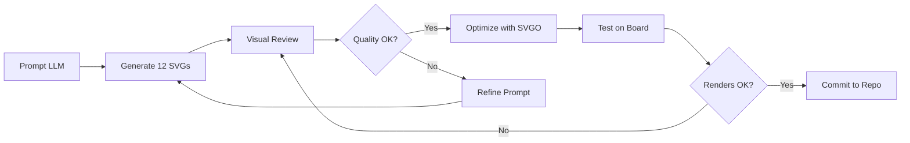

# 🎨 ChessMate Piece System Upgrade: Emoji → SVG

**Production-Ready Plan for Multi-Theme Piece Architecture**

> Structured like a real game studio product roadmap

---

## 📋 Executive Summary

### Current State
- **Rendering**: Unicode emoji characters (`♔♕♖♗♘♙`)
- **Limitations**:
  - Inconsistent appearance across platforms (iOS/Android/Web)
  - No style customization
  - Poor scaling at different sizes
  - Limited visual fidelity
  - No animation potential

### Target State
- **Rendering**: SVG-based vector graphics
- **Benefits**:
  - Pixel-perfect rendering at any scale
  - Full style control (colors, strokes, fills)
  - Cross-platform consistency
  - Multiple theme support
  - Smooth animations
  - Future PNG texture support

### Impact
- **User Experience**: Professional-grade visuals matching Chess.com/Lichess
- **Developer Experience**: Extensible theme system for infinite customization
- **Performance**: Lightweight assets, faster rendering than emoji
- **Product**: Foundation for premium themes monetization

---

## 🎯 PHASE 1 — Define the Piece Architecture (Core Decision)

> **Goal**: Establish flexible, scalable foundation before generating assets

### 1.1 Piece Naming Convention (Industry Standard)

We use the **universal 12-key notation** recognized by chess engines globally:

```
White pieces: wK, wQ, wR, wB, wN, wP
Black pieces: bK, bQ, bR, bB, bN, bP
```

**Rationale**:
- ✅ Matches FEN notation (`K`=King, `Q`=Queen, etc.)
- ✅ Compatible with chess.js, Stockfish, Lichess API
- ✅ Alphabetically sortable
- ✅ URL-friendly (for CDN paths)

**Alternative Rejected**:
- `white-king.svg` → Too verbose, not engine-compatible
- `king_w.svg` → Inconsistent with FEN standard

### 1.2 File Structure

```
app/
  assets/
    pieces/
      minimal/          # Theme 1: Minimal Flat (Lichess-style)
        wK.svg
        wQ.svg
        wR.svg
        wB.svg
        wN.svg
        wP.svg
        bK.svg
        bQ.svg
        bR.svg
        bB.svg
        bN.svg
        bP.svg
      solid/            # Theme 2: Solid Filled (Material Modern)
        wK.svg
        ... (12 files)
      outline/          # Theme 3: Classic Outline (Chess.com-style)
        wK.svg
        ... (12 files)
      neon/             # Future: Neon theme
      glass/            # Future: Glass theme (PNG)
      wood/             # Future: Wood texture (PNG)
```

**Folder Naming Convention**:
- Lowercase, single-word theme names
- No hyphens (breaks some bundlers)
- Theme name = folder name = config key

### 1.3 SVG Standards

Every SVG asset **MUST** follow these specs:

```xml
<svg 
  width="45" 
  height="45" 
  viewBox="0 0 45 45" 
  xmlns="http://www.w3.org/2000/svg"
>
  <!-- Clean <path> elements only -->
  <!-- No embedded raster images -->
  <!-- No complex filters (for performance) -->
</svg>
```

**Technical Requirements**:
| Property | Value | Rationale |
|----------|-------|-----------|
| `viewBox` | `0 0 45 45` | Standard chess piece aspect ratio |
| `width/height` | `45px` | Matches Lichess/Chess.com default |
| Stroke width | `1.5-2px` | Crisp at mobile resolutions |
| Fill colors | `currentColor` or theme-specific | Enables dynamic theming |
| Optimization | SVGO processed | Remove metadata, reduce size |

### 1.4 Component Architecture

```typescript
// Core type system
export type PieceKey = 'wK' | 'wQ' | 'wR' | 'wB' | 'wN' | 'wP' 
                      | 'bK' | 'bQ' | 'bR' | 'bB' | 'bN' | 'bP';

export type PieceTheme = 'minimal' | 'solid' | 'outline' | 'neon' | 'glass';

// Piece set structure
export interface PieceSet {
  name: string;
  displayName: string;
  description: string;
  premium: boolean;
  pieces: Record<PieceKey, React.FC<SvgProps>>;
}

// Central registry
export const pieceSets: Record<PieceTheme, PieceSet> = {
  minimal: minimalPieceSet,
  solid: solidPieceSet,
  outline: outlinePieceSet,
  // ... future themes
};
```

### 1.5 Dynamic Theme Switching

**API Design**:

```tsx
// Usage in components
<ChessBoard pieceTheme="minimal" />

// Usage in settings
const { pieceTheme, setPieceTheme } = useBoardTheme();
setPieceTheme('solid');
```

**Implementation Strategy**:
1. **Context-based**: `BoardThemeContext` stores active theme
2. **Lazy loading**: Load theme assets on-demand
3. **Hot swapping**: No board remount required
4. **Persistence**: Save preference to AsyncStorage

---

## 🎨 PHASE 2 — Choose Initial Theme Set

> **Goal**: Launch with 3 polished themes covering different player preferences

### Theme Selection Matrix

| Theme | Style | Target Audience | Complexity | Priority |
|-------|-------|-----------------|------------|----------|
| **Minimal Flat** | Lichess-inspired, thin outlines | Modern players, mobile users | Low | P0 (MVP) |
| **Solid Filled** | Bold silhouettes, Material Design | Casual players, busy backgrounds | Low | P0 (MVP) |
| **Classic Outline** | Traditional, Chess.com-style | Tournament players, purists | Medium | P0 (MVP) |
| **Neon** | Glowing edges, cyberpunk | Esports, streaming | Medium | P1 |
| **Glass** | Translucent, frosted | Premium users | High | P2 |

### 2.1 Theme A — Minimal Flat (Lichess-style)

**Design Principles**:
- Thin stroke-based outlines (1.5px)
- Minimal internal detail
- High contrast for readability
- Works on any background

**Visual Characteristics**:
```css
stroke: currentColor;
stroke-width: 1.5px;
fill: none; /* outline only */
```

**Best For**:
- Mobile devices (crisp at small sizes)
- Players who prefer minimalism
- Light/dark mode adaptability

**Reference**: Lichess's default piece set

### 2.2 Theme B — Solid Filled (Material Modern)

**Design Principles**:
- Filled silhouettes with no outlines
- Bold, recognizable shapes
- Inspired by Google Material Design

**Visual Characteristics**:
```css
fill: currentColor;
stroke: none;
```

**Best For**:
- Players who want maximum visibility
- Busy/textured board backgrounds
- Accessibility (high contrast)

**Reference**: Chess.com's "Neo" set

### 2.3 Theme C — Classic Outline (Chess.com 2D-style)

**Design Principles**:
- Thicker outlines (2px)
- Internal shape details
- Traditional chess diagram appearance

**Visual Characteristics**:
```css
stroke: currentColor;
stroke-width: 2px;
fill: rgba(currentColor, 0.1); /* slight fill */
```

**Best For**:
- Tournament players
- Users familiar with printed chess books
- Traditional aesthetic preference

**Reference**: Chess.com's default 2D pieces

---

## 🛠️ PHASE 3 — Generate SVG Assets

> **Goal**: Create 36 production-ready SVG files (12 pieces × 3 themes)

### 3.1 Asset Generation Strategy

**Options**:

| Method | Pros | Cons | Recommended |
|--------|------|------|-------------|
| **Manual Design** (Figma/Illustrator) | Full control, perfect output | Time-intensive | ✅ For hero themes |
| **LLM Generation** (GPT-4, Claude) | Fast, consistent | May need refinement | ✅ For MVP |
| **Icon Library** (Noun Project) | Pre-made, tested | License restrictions | ❌ Limited customization |

**Chosen Approach**: **LLM-assisted generation with manual refinement**

### 3.2 Generation Workflow



### 3.3 LLM Prompt Template

```
Generate a clean SVG chess piece with these specifications:

**Piece**: White King (wK)
**Style**: Minimal Flat (Lichess-inspired)
**Requirements**:
- viewBox="0 0 45 45"
- Thin outlines (stroke-width: 1.5px)
- No fill, stroke-only
- Crown shape with cross on top
- Minimalist geometry
- Centered in viewBox
- No embedded text or metadata

**Output**: Raw SVG code only, no explanations.
```

### 3.4 Post-Generation Checklist

For each SVG file:
- [ ] Valid XML syntax
- [ ] Correct viewBox (0 0 45 45)
- [ ] No hardcoded colors (use `currentColor`)
- [ ] Optimized with SVGO
- [ ] File size < 2KB
- [ ] Renders correctly on white/black backgrounds
- [ ] Scales cleanly at 24px, 48px, 96px

### 3.5 SVGO Configuration

```json
{
  "plugins": [
    "removeDoctype",
    "removeXMLProcInst",
    "removeComments",
    "removeMetadata",
    "removeEditorsNSData",
    "cleanupAttrs",
    "mergeStyles",
    "inlineStyles",
    "minifyStyles",
    "cleanupIds",
    "removeUselessDefs",
    "cleanupNumericValues",
    "convertColors",
    "removeUnknownsAndDefaults",
    "removeNonInheritableGroupAttrs",
    "removeUselessStrokeAndFill",
    "cleanupEnableBackground",
    "removeHiddenElems",
    "removeEmptyText",
    "convertShapeToPath",
    "moveElemsAttrsToGroup",
    "moveGroupAttrsToElems",
    "collapseGroups",
    "convertPathData",
    "convertTransform",
    "removeEmptyAttrs",
    "removeEmptyContainers",
    "mergePaths",
    "removeUnusedNS",
    "sortAttrs",
    "removeTitle",
    "removeDesc"
  ]
}
```

---

## ⚛️ PHASE 4 — Build React Integration Layer

> **Goal**: Create reusable, type-safe component system

### 4.1 Directory Structure

```
app/
  features/
    board/
      components/
        ChessBoard.tsx          # Main board component (already exists)
        Piece.tsx               # NEW: Individual piece renderer
        PieceSetProvider.tsx    # NEW: Theme context provider
      config/
        themeConfig.ts          # Extend existing theme config
        pieceSetRegistry.ts     # NEW: Piece set definitions
      assets/                   # NEW: Local reference (optional)
  assets/
    pieces/                     # Asset storage
      minimal/
      solid/
      outline/
```

### 4.2 Core Component: `Piece.tsx`

```tsx
import React from 'react';
import { View, StyleSheet } from 'react-native';
import { SvgProps } from 'react-native-svg';
import { pieceSets } from '@/features/board/config/pieceSetRegistry';
import type { PieceKey, PieceTheme } from '@/features/board/types';

interface PieceProps {
  piece: PieceKey;
  theme: PieceTheme;
  size?: number;
  color?: string;
  style?: any;
}

export const Piece: React.FC<PieceProps> = ({
  piece,
  theme,
  size = 45,
  color = 'currentColor',
  style,
}) => {
  const pieceSet = pieceSets[theme];
  
  if (!pieceSet) {
    console.warn(`Piece theme "${theme}" not found, falling back to minimal`);
    theme = 'minimal';
  }
  
  const PieceComponent = pieceSet.pieces[piece];
  
  if (!PieceComponent) {
    console.error(`Piece "${piece}" not found in theme "${theme}"`);
    return null;
  }
  
  return (
    <View style={[styles.container, { width: size, height: size }, style]}>
      <PieceComponent 
        width={size} 
        height={size} 
        fill={color}
        style={styles.svg}
      />
    </View>
  );
};

const styles = StyleSheet.create({
  container: {
    alignItems: 'center',
    justifyContent: 'center',
  },
  svg: {
    width: '100%',
    height: '100%',
  },
});
```

### 4.3 Piece Set Registry

```typescript
// app/features/board/config/pieceSetRegistry.ts

import { PieceSet, PieceTheme } from '@/features/board/types';

// Import SVG components (generated by Metro bundler)
import MinimalWK from '@/assets/pieces/minimal/wK.svg';
import MinimalWQ from '@/assets/pieces/minimal/wQ.svg';
// ... (import all 12 pieces per theme)

const minimalPieceSet: PieceSet = {
  name: 'minimal',
  displayName: 'Minimal Flat',
  description: 'Clean, Lichess-inspired minimal outlines',
  premium: false,
  pieces: {
    wK: MinimalWK,
    wQ: MinimalWQ,
    wR: MinimalWR,
    wB: MinimalWB,
    wN: MinimalWN,
    wP: MinimalWP,
    bK: MinimalBK,
    bQ: MinimalBQ,
    bR: MinimalBR,
    bB: MinimalBB,
    bN: MinimalBN,
    bP: MinimalBP,
  },
};

// Repeat for solid and outline themes

export const pieceSets: Record<PieceTheme, PieceSet> = {
  minimal: minimalPieceSet,
  solid: solidPieceSet,
  outline: outlinePieceSet,
};

// Helper to get piece set metadata
export const getPieceSetInfo = (theme: PieceTheme) => {
  const set = pieceSets[theme];
  return {
    displayName: set.displayName,
    description: set.description,
    premium: set.premium,
  };
};
```

### 4.4 Extend `BoardThemeContext`

```typescript
// app/contexts/BoardThemeContext.tsx (extend existing)

import { PieceTheme } from '@/features/board/types';

interface BoardThemeContextValue {
  // ... existing properties
  pieceTheme: PieceTheme;
  setPieceTheme: (theme: PieceTheme) => void;
}

// In provider:
const [pieceTheme, setPieceTheme] = useState<PieceTheme>('minimal');

// Load from storage
useEffect(() => {
  AsyncStorage.getItem('pieceTheme').then((saved) => {
    if (saved && Object.keys(pieceSets).includes(saved)) {
      setPieceTheme(saved as PieceTheme);
    }
  });
}, []);

// Save to storage
useEffect(() => {
  AsyncStorage.setItem('pieceTheme', pieceTheme);
}, [pieceTheme]);
```

### 4.5 Update `ChessBoard.tsx`

**Replace emoji rendering**:

```tsx
// OLD (current implementation):
const getPieceEmoji = (piece: Piece | null): string => {
  if (!piece) return '';
  const pieces: Record<PieceType, Record<Color, string>> = {
    K: { w: '♔', b: '♚' },
    // ...
  };
  return pieces[piece.type][piece.color];
};

// Render:
<Text style={styles.piece}>{getPieceEmoji(piece)}</Text>
```

**NEW (SVG-based)**:

```tsx
import { Piece } from './Piece';
import { useBoardTheme } from '@/contexts/BoardThemeContext';

// In component:
const { pieceTheme } = useBoardTheme();

// Helper to convert Piece object to PieceKey
const getPieceKey = (piece: Piece): PieceKey => {
  return `${piece.color}${piece.type}` as PieceKey;
};

// Render:
{piece && (
  <Piece 
    piece={getPieceKey(piece)}
    theme={pieceTheme}
    size={squareSize * 0.85} // Leave padding
    style={styles.piece}
  />
)}
```

### 4.6 Styling and Effects

```typescript
// Enhanced piece styling with shadows
const styles = StyleSheet.create({
  piece: {
    position: 'absolute',
    filter: 'drop-shadow(0 2px 3px rgba(0, 0, 0, 0.35))',
    transition: 'transform 120ms ease',
  },
});

// Hover effect (web only)
if (Platform.OS === 'web') {
  styles.piece = {
    ...styles.piece,
    ':hover': {
      transform: 'scale(1.05)',
      cursor: 'grab',
    },
  };
}
```

---

## 🎨 PHASE 5 — Add Color Theming Support

> **Goal**: Enable light/dark piece variants without duplicating assets

### 5.1 Dynamic Color Application

**Strategy**: Use SVG's `currentColor` + CSS filters

```tsx
// Light mode pieces
<Piece 
  piece="wK" 
  theme="minimal"
  color="#f0f0f0" // Light color for white pieces
/>

// Dark mode pieces
<Piece 
  piece="bK" 
  theme="minimal"
  color="#333333" // Dark color for black pieces
/>
```

### 5.2 Theme-Aware Colors

```typescript
// In BoardThemeContext:
export const getPieceColors = (mode: ThemeMode) => ({
  white: mode === 'light' ? '#f0f0f0' : '#e8e8e8',
  black: mode === 'light' ? '#2c2c2c' : '#1a1a1a',
});

// Usage:
const pieceColors = getPieceColors(mode);

<Piece 
  piece={getPieceKey(piece)}
  theme={pieceTheme}
  color={piece.color === 'w' ? pieceColors.white : pieceColors.black}
/>
```

### 5.3 Monochrome Variant Support

For future "silhouette" style themes:

```typescript
// Generate monochrome pieces programmatically
export const monochromeFilter = (baseTheme: PieceTheme): PieceSet => ({
  ...pieceSets[baseTheme],
  name: `${baseTheme}-mono`,
  displayName: `${pieceSets[baseTheme].displayName} (Mono)`,
  // Apply CSS filter to remove colors
});
```

---

## 🌟 PHASE 6 — Add Premium Themes (PNG Sets)

> **Goal**: Monetization-ready texture-based themes

### 6.1 When to Use PNG vs SVG

| Asset Type | Use Case | Format |
|------------|----------|--------|
| **Flat/Outline** | Minimal, Solid, Outline | SVG |
| **Textured** | Wood, Stone, Glass, Metal | PNG (2x, 3x) |
| **Photorealistic** | Crystal, Marble | PNG (2x, 3x) |
| **Animated** | Fire, Ice, Neon glow | Lottie JSON |

### 6.2 Premium Theme Structure

```
app/
  assets/
    pieces/
      glass/              # Premium PNG set
        wK@2x.png         # 90x90px
        wK@3x.png         # 135x135px
        wK.png            # 45x45px (fallback)
        ... (12 pieces × 3 resolutions)
      wood/
      marble/
```

### 6.3 Premium Theme Metadata

```typescript
const glassPieceSet: PieceSet = {
  name: 'glass',
  displayName: 'Frosted Glass',
  description: 'Translucent glass pieces with realistic refraction',
  premium: true, // ← Paywall flag
  pieces: {
    wK: require('@/assets/pieces/glass/wK.png'),
    // ... PNG requires
  },
};
```

### 6.4 Monetization Hook

```tsx
const { isPremiumUser } = useSubscription();

// In theme selection:
{pieceSet.premium && !isPremiumUser && (
  <View style={styles.premiumBadge}>
    <Text>👑 Pro</Text>
  </View>
)}

// On selection:
const handleThemeSelect = (theme: PieceTheme) => {
  const set = pieceSets[theme];
  if (set.premium && !isPremiumUser) {
    navigation.navigate('Paywall', { feature: 'premium-pieces' });
  } else {
    setPieceTheme(theme);
  }
};
```

---

## 🔄 PHASE 7 — Migration of Existing Board Logic

> **Goal**: Zero-downtime migration from emoji to SVG

### 7.1 Migration Strategy: Feature Flag

```typescript
// In BoardThemeContext:
const [useSvgPieces, setUseSvgPieces] = useState(false);

// Gradual rollout:
// 1. Deploy with useSvgPieces=false (emoji still active)
// 2. Enable for beta users
// 3. A/B test performance
// 4. Full rollout: useSvgPieces=true
// 5. Remove emoji code
```

### 7.2 Backward Compatibility Layer

```tsx
// In ChessBoard.tsx:
const renderPiece = (piece: Piece | null, size: number) => {
  if (!piece) return null;
  
  if (useSvgPieces) {
    // NEW: SVG rendering
    return (
      <Piece 
        piece={getPieceKey(piece)}
        theme={pieceTheme}
        size={size}
      />
    );
  } else {
    // OLD: Emoji rendering (fallback)
    return (
      <Text style={[styles.pieceEmoji, { fontSize: size }]}>
        {getPieceEmoji(piece)}
      </Text>
    );
  }
};
```

### 7.3 Migration Checklist

- [ ] Deploy SVG assets to CDN/bundle
- [ ] Add feature flag `useSvgPieces` (default: false)
- [ ] Test on iOS, Android, Web
- [ ] Enable for 10% of users (A/B test)
- [ ] Monitor performance metrics:
  - [ ] Initial render time
  - [ ] Move animation smoothness
  - [ ] Memory usage
- [ ] Roll out to 50% → 100%
- [ ] Remove emoji rendering code
- [ ] Delete emoji utility functions

### 7.4 Rollback Plan

If SVG causes issues:

```typescript
// Emergency rollback (env variable):
const USE_SVG_PIECES = process.env.EXPO_PUBLIC_USE_SVG_PIECES === 'true';

// Or remote config (Firebase):
const config = await remoteConfig().fetch();
const useSvg = config.getBoolean('use_svg_pieces');
```

---

## ⚡ PHASE 8 — Performance Optimization

> **Goal**: Ensure SVG rendering is faster than emoji

### 8.1 Asset Loading Strategy

**Problem**: Loading 12 SVGs per theme = 36 network requests (slow)

**Solution**: Bundle SVGs with Metro

```typescript
// Metro bundler automatically inlines SVGs as components
import WK from '@/assets/pieces/minimal/wK.svg';

// No runtime HTTP requests needed
// SVG code embedded in JS bundle
```

**Optimization**:
- ✅ Tree-shaking: Only load active theme
- ✅ Code splitting: Lazy-load premium themes
- ✅ Compression: Gzip/Brotli reduces bundle size

### 8.2 Rendering Performance

**Memoization**:

```tsx
// Prevent unnecessary re-renders
const Piece = React.memo<PieceProps>(({ piece, theme, size, color }) => {
  const PieceComponent = useMemo(
    () => pieceSets[theme].pieces[piece],
    [theme, piece]
  );
  
  return <PieceComponent width={size} height={size} fill={color} />;
});
```

**Profiling**:

```bash
# React Native performance monitor
npx react-native start --profile

# Expected metrics:
# - Piece render: < 16ms (60fps)
# - Board initial render: < 100ms
# - Theme switch: < 50ms
```

### 8.3 Memory Management

**Issue**: SVG components stay in memory

**Solution**: Lazy loading

```tsx
const LazyPieceSet = React.lazy(() => 
  import(`@/assets/pieces/${theme}/index.ts`)
);

// Only load when theme selected
<Suspense fallback={<ActivityIndicator />}>
  <LazyPieceSet piece={piece} />
</Suspense>
```

### 8.4 Mobile-Specific Optimizations

```typescript
// Reduce shadow complexity on mobile
const shadowStyle = Platform.select({
  ios: shadowTokens.sm,
  android: { elevation: 2 }, // Native elevation (faster)
  web: shadowTokens.md,
});

// Disable expensive effects on low-end devices
const { isLowEndDevice } = useDeviceInfo();

const pieceStyle = {
  ...styles.piece,
  filter: isLowEndDevice ? 'none' : 'drop-shadow(...)',
};
```

---

## ✅ PHASE 9 — Ready-to-Execute Backlog

> **Goal**: Break down into actionable tickets for development

### Sprint 1: Foundation (Week 1)

#### Ticket 1.1: Create Asset Directory Structure
**Story Points**: 1  
**Tasks**:
- [ ] Create `app/assets/pieces/` directory
- [ ] Create subdirectories: `minimal/`, `solid/`, `outline/`
- [ ] Add `.gitkeep` files
- [ ] Update `.gitignore` (ensure SVGs tracked)

**Acceptance Criteria**:
- Folder structure matches design doc
- Accessible in Metro bundler

---

#### Ticket 1.2: Define Type System
**Story Points**: 2  
**Tasks**:
- [ ] Create `app/features/board/types/pieces.ts`
- [ ] Define `PieceKey`, `PieceTheme`, `PieceSet` types
- [ ] Add JSDoc documentation
- [ ] Export from `index.ts`

**Files Created**:
```typescript
// app/features/board/types/pieces.ts
export type PieceKey = 'wK' | 'wQ' | 'wR' | 'wB' | 'wN' | 'wP' 
                      | 'bK' | 'bQ' | 'bR' | 'bB' | 'bN' | 'bP';

export type PieceTheme = 'minimal' | 'solid' | 'outline';

export interface PieceSet {
  name: string;
  displayName: string;
  description: string;
  premium: boolean;
  pieces: Record<PieceKey, React.FC<SvgProps>>;
}
```

**Acceptance Criteria**:
- Types compile without errors
- Exported in `@/features/board/types`

---

#### Ticket 1.3: Generate Minimal Theme SVGs (12 pieces)
**Story Points**: 5  
**Tasks**:
- [ ] Generate SVGs using LLM (wK, wQ, wR, wB, wN, wP, bK, bQ, bR, bB, bN, bP)
- [ ] Optimize with SVGO
- [ ] Visual QA: Test on white/black backgrounds
- [ ] Save to `assets/pieces/minimal/`

**LLM Prompt Example**:
```
Generate a clean SVG chess piece (White King) with:
- viewBox="0 0 45 45"
- Minimal flat style (Lichess-inspired)
- Thin outlines (stroke-width: 1.5px)
- No fill, stroke-only
- Crown with cross on top
- Centered, no metadata
Output: Raw SVG code only.
```

**Acceptance Criteria**:
- All 12 SVGs < 2KB each
- Render correctly at 24px, 48px, 96px
- Pass validation: `svgo --pretty --multipass minimal/*.svg`

---

#### Ticket 1.4: Configure Metro for SVG Support
**Story Points**: 2  
**Tasks**:
- [ ] Install `react-native-svg-transformer`
- [ ] Update `metro.config.js`
- [ ] Test SVG import: `import WK from '@/assets/pieces/minimal/wK.svg'`

**Metro Config**:
```js
// metro.config.js
const { getDefaultConfig } = require('expo/metro-config');

const config = getDefaultConfig(__dirname);

config.transformer.babelTransformerPath = require.resolve('react-native-svg-transformer');
config.resolver.assetExts = config.resolver.assetExts.filter((ext) => ext !== 'svg');
config.resolver.sourceExts = [...config.resolver.sourceExts, 'svg'];

module.exports = config;
```

**Acceptance Criteria**:
- SVG imports work without errors
- TypeScript recognizes `.svg` files

---

### Sprint 2: Component Development (Week 2)

#### Ticket 2.1: Implement Piece Component
**Story Points**: 3  
**Tasks**:
- [ ] Create `app/features/board/components/Piece.tsx`
- [ ] Accept props: `piece`, `theme`, `size`, `color`
- [ ] Render SVG component from registry
- [ ] Add error handling for missing pieces
- [ ] Write unit tests

**Component Code**: See PHASE 4.2

**Tests**:
```tsx
describe('Piece', () => {
  it('renders white king in minimal theme', () => {
    const { getByTestId } = render(
      <Piece piece="wK" theme="minimal" size={45} />
    );
    expect(getByTestId('piece-wK')).toBeTruthy();
  });
  
  it('falls back to minimal theme if invalid', () => {
    const { getByTestId } = render(
      <Piece piece="wK" theme="invalid" size={45} />
    );
    expect(getByTestId('piece-wK')).toBeTruthy();
  });
});
```

**Acceptance Criteria**:
- Component renders without errors
- Handles invalid theme gracefully
- Unit tests pass

---

#### Ticket 2.2: Create Piece Set Registry
**Story Points**: 3  
**Tasks**:
- [ ] Create `app/features/board/config/pieceSetRegistry.ts`
- [ ] Import all 12 minimal SVGs
- [ ] Define `minimalPieceSet` object
- [ ] Export `pieceSets` registry
- [ ] Add helper: `getPieceSetInfo(theme)`

**File Structure**: See PHASE 4.3

**Acceptance Criteria**:
- Registry exports valid `pieceSets` object
- All 12 pieces accessible via `pieceSets.minimal.pieces.wK`
- TypeScript autocomplete works

---

#### Ticket 2.3: Extend BoardThemeContext with Piece Theme
**Story Points**: 3  
**Tasks**:
- [ ] Add `pieceTheme` state to context
- [ ] Add `setPieceTheme` action
- [ ] Persist to AsyncStorage
- [ ] Load on app startup
- [ ] Update context types

**Code**: See PHASE 4.4

**Acceptance Criteria**:
- Piece theme persists across app restarts
- Context provides current piece theme
- TypeScript types updated

---

#### Ticket 2.4: Update Settings Screen
**Story Points**: 2  
**Tasks**:
- [ ] Open `app/app/settings/board-theme.tsx`
- [ ] Add piece theme selector section
- [ ] Display all available themes from registry
- [ ] Wire up `setPieceTheme` action
- [ ] Show preview of selected theme

**Acceptance Criteria**:
- User can switch piece themes
- Selection persists
- Preview updates instantly

---

### Sprint 3: Board Integration (Week 3)

#### Ticket 3.1: Migrate ChessBoard to Use Piece Component
**Story Points**: 5  
**Tasks**:
- [ ] Replace `getPieceEmoji()` with `getPieceKey()` helper
- [ ] Replace `<Text>{emoji}</Text>` with `<Piece />`
- [ ] Update piece rendering logic
- [ ] Test on all platforms (iOS, Android, Web)
- [ ] Verify move animations still work

**Code**: See PHASE 4.5

**Acceptance Criteria**:
- Board renders with SVG pieces
- No emoji fallback needed
- Move animations smooth
- No visual regressions

---

#### Ticket 3.2: Add Feature Flag for Gradual Rollout
**Story Points**: 2  
**Tasks**:
- [ ] Add `USE_SVG_PIECES` env variable
- [ ] Wrap SVG rendering in conditional
- [ ] Keep emoji rendering as fallback
- [ ] Test both paths

**Acceptance Criteria**:
- Flag toggles between emoji/SVG
- No errors in either mode

---

#### Ticket 3.3: Performance Testing
**Story Points**: 3  
**Tasks**:
- [ ] Profile board render time
- [ ] Compare emoji vs SVG performance
- [ ] Test on low-end devices
- [ ] Optimize if needed (memoization)

**Metrics**:
| Metric | Target | Current (Emoji) | New (SVG) |
|--------|--------|-----------------|-----------|
| Initial render | < 100ms | 80ms | ? |
| Move animation | < 16ms | 12ms | ? |
| Memory usage | < 50MB | 42MB | ? |

**Acceptance Criteria**:
- SVG performance ≥ emoji performance
- No jank on 60fps animations

---

### Sprint 4: Additional Themes (Week 4)

#### Ticket 4.1: Generate Solid Theme SVGs
**Story Points**: 4  
**Tasks**:
- [ ] Generate 12 solid-filled SVGs
- [ ] Optimize and QA
- [ ] Add to registry

**Acceptance Criteria**:
- Solid theme selectable in settings
- Renders correctly on board

---

#### Ticket 4.2: Generate Outline Theme SVGs
**Story Points**: 4  
**Tasks**:
- [ ] Generate 12 outline SVGs
- [ ] Optimize and QA
- [ ] Add to registry

**Acceptance Criteria**:
- Outline theme selectable in settings
- Renders correctly on board

---

#### Ticket 4.3: Add Color Theming Support
**Story Points**: 3  
**Tasks**:
- [ ] Implement `getPieceColors()` helper
- [ ] Pass dynamic colors to Piece component
- [ ] Test light/dark mode switching

**Acceptance Criteria**:
- Pieces adapt to light/dark mode
- Colors match board theme

---

### Sprint 5: Polish & Launch (Week 5)

#### Ticket 5.1: UI/UX Polish
**Story Points**: 3  
**Tasks**:
- [ ] Add drop shadows to pieces
- [ ] Add hover effects (web)
- [ ] Add press feedback (mobile)
- [ ] Test accessibility (screen readers)

**Acceptance Criteria**:
- Pieces have subtle shadows
- Hover/press states feel responsive

---

#### Ticket 5.2: Documentation
**Story Points**: 2  
**Tasks**:
- [ ] Update `app/docs/design-language-system.md`
- [ ] Document piece theme system
- [ ] Add usage examples
- [ ] Create README for `assets/pieces/`

**Acceptance Criteria**:
- Developers can add new themes using docs
- Clear examples provided

---

#### Ticket 5.3: Remove Emoji Code (Cleanup)
**Story Points**: 2  
**Tasks**:
- [ ] Delete `getPieceEmoji()` function
- [ ] Remove emoji mapping object
- [ ] Remove feature flag
- [ ] Clean up unused imports

**Acceptance Criteria**:
- No emoji rendering code remains
- Codebase cleaner

---

#### Ticket 5.4: Production Rollout
**Story Points**: 1  
**Tasks**:
- [ ] Deploy to production
- [ ] Monitor error rates
- [ ] Monitor performance metrics
- [ ] Announce new themes to users

**Acceptance Criteria**:
- Zero critical errors
- User feedback positive

---

### Future Backlog (Post-MVP)

#### Premium Themes
- [ ] Design glass theme (PNG)
- [ ] Design wood theme (PNG)
- [ ] Implement premium paywall
- [ ] A/B test premium conversion

#### Advanced Features
- [ ] Animated pieces (Lottie)
- [ ] User-uploaded themes
- [ ] Theme marketplace
- [ ] AI-generated themes

---

## 📊 Success Metrics

### Key Performance Indicators (KPIs)

| Metric | Baseline (Emoji) | Target (SVG) | Measurement |
|--------|------------------|--------------|-------------|
| **Render Performance** | 80ms | < 100ms | React DevTools Profiler |
| **Bundle Size** | 0KB (emoji built-in) | < 50KB (3 themes) | Webpack Bundle Analyzer |
| **User Satisfaction** | N/A | > 4.5/5 stars | In-app survey |
| **Theme Adoption** | 0% (no themes) | > 40% users switch | Analytics event |
| **Premium Conversion** | N/A | > 5% of users | Revenue tracking |

### Monitoring

```typescript
// Track theme usage
analytics.track('piece_theme_changed', {
  from: previousTheme,
  to: newTheme,
  user_id: userId,
});

// Track performance
performance.mark('board-render-start');
// ... render board ...
performance.mark('board-render-end');
performance.measure('board-render', 'board-render-start', 'board-render-end');
```

---

## 🚧 Risk Mitigation

### Risk 1: SVG Performance Worse Than Emoji
**Likelihood**: Medium  
**Impact**: High  
**Mitigation**:
- Thorough performance testing before rollout
- Keep emoji fallback during migration
- Optimize SVGs aggressively (SVGO, memoization)
- Use feature flag for instant rollback

### Risk 2: Cross-Platform Rendering Issues
**Likelihood**: Medium  
**Impact**: Medium  
**Mitigation**:
- Test on real iOS/Android/Web devices (not just simulators)
- Use `react-native-svg` (battle-tested library)
- Visual regression testing with Percy/Chromatic

### Risk 3: Bundle Size Bloat
**Likelihood**: Low  
**Impact**: Medium  
**Mitigation**:
- Lazy-load premium themes
- Use tree-shaking
- Monitor bundle size in CI/CD
- Set max threshold: 50KB per theme

### Risk 4: User Doesn't Like New Pieces
**Likelihood**: Low  
**Impact**: Low  
**Mitigation**:
- Keep emoji fallback as "Classic" theme
- A/B test theme defaults
- User research on preferred styles

---

## 📚 References

### Design Inspiration
- **Lichess**: https://lichess.org (minimal flat style)
- **Chess.com**: https://chess.com (multiple theme examples)
- **LiChess GitHub**: https://github.com/lichess-org/lila (SVG piece sets)

### Technical Resources
- **react-native-svg**: https://github.com/software-mansion/react-native-svg
- **SVGO**: https://github.com/svg/svgo (SVG optimization)
- **Metro SVG Transformer**: https://github.com/kristerkari/react-native-svg-transformer

### Asset Tools
- **Figma**: Design and export SVGs
- **Illustrator**: Professional vector editing
- **Inkscape**: Free, open-source SVG editor

---

## 🎯 Conclusion

This plan provides a **production-ready roadmap** for upgrading ChessMate from emoji to professional SVG pieces.

**Key Outcomes**:
1. ✅ **Flexible Architecture**: Infinite theme extensibility
2. ✅ **Performance**: Optimized for 60fps gameplay
3. ✅ **Cross-Platform**: Consistent on iOS/Android/Web
4. ✅ **Monetization**: Foundation for premium themes
5. ✅ **Developer Experience**: Easy to add new themes

**Next Steps**:
1. Review and approve this plan
2. Assign Sprint 1 tickets to development team
3. Generate initial SVG assets (Minimal theme)
4. Begin implementation following backlog

**Timeline**: 5 weeks (1 sprint per phase)

---

*Last Updated: 2025-12-04*  
*Status: Ready for Implementation*  
*Owner: Frontend Team*
